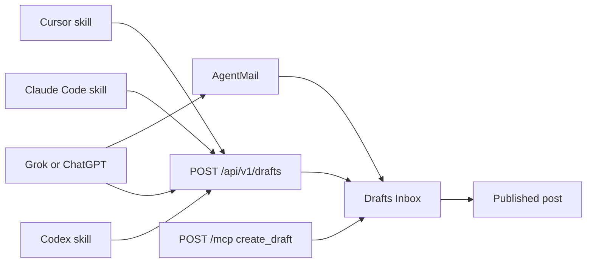

# Agent blog setup guide

The publish pipeline already exists. Agents never write live posts. They file a draft. You approve it in the Drafts Inbox, by email reply, or by merging a review PR.

The reason Cursor, Claude Code, Codex, and a terminal cannot post today is ops, not missing code: prod `apiKeys` is empty, `blogskill` only lives in this repo, and `voiceProfile.rules` is empty. `POST /api/v1/drafts` currently returns 401 for every agent.

## How the pieces actually work

| Door                       | Auth                                                                                                               | Use this for                                                                        |
| -------------------------- | ------------------------------------------------------------------------------------------------------------------ | ----------------------------------------------------------------------------------- |
| HTTP `POST /api/v1/drafts` | `x-api-key: wsa_...` (pipeline key, hashed in `apiKeys`)                                                           | Cursor, Claude Code, Codex, OpenCode, any terminal. **Primary.**                    |
| MCP `POST /mcp`            | Read tools: public unless `MCP_API_KEY` is set. Write: must require the same pipeline key (see code change below). | Optional. Nice inside Cursor or Claude if HTTP skills already work.                 |
| AgentMail inbox            | Webhook secret + sender allowlist                                                                                  | Grok, phone, ChatGPT copy-paste, anything that can send email. **Already working.** |
| Dashboard paste            | Logged-in admin                                                                                                    | Clipboard fallback.                                                                 |
| X import                   | Logged-in admin                                                                                                    | Paste an X URL in the X section.                                                    |

**Two kinds of keys, do not mix them:**

- **Pipeline keys** (`wsa_...`): generated in Dashboard → API Keys. One per tool. Shown once, stored hashed. This is what agents send. Export as `BLOG_POST_KEY` **on your machine**.
- **Vendor keys** (`OPENAI_API_KEY`, `AGENTMAIL_*`, `GITHUB_*`, etc.): Convex env vars or dashboard overrides. These run the voice agent, email, and PRs. Agents never see them.

**Gotcha:** localhost dashboard writes to **dev** (`notable-loris-927`). Generate the live key on [https://waynesutton.ai/dashboard](https://waynesutton.ai/dashboard). A key from localhost will 401 against production.

## What to steal from OpenSync

Copy: prefixed keys shown once, revoke, last-used, identical per-tool setup sections, a verify step, an agent-executable install doc.

Skip: npm plugins per IDE, session-file watchers, WorkOS plan limits, requiring a Convex `.cloud` URL in agent config.

## Recommended MCP security fix

Today `create_draft` in [convex/mcp.ts](convex/mcp.ts) uses Convex env `BLOG_POST_KEY`. If that env var is set and `MCP_API_KEY` is unset, **anyone** who can hit `/mcp` can file drafts.

Change it so `create_draft` verifies `Authorization: Bearer wsa_...` or `x-api-key` against the `apiKeys` table, same as [convex/http.ts](convex/http.ts) `/api/v1/drafts`. Then:

- Public MCP stays read-only
- Write uses the same key as the skill and curl
- Stop needing a second Convex env `BLOG_POST_KEY` for MCP

Leave `MCP_API_KEY` optional: if set, **all** MCP calls (including reads) require that bearer. Default: leave it unset so discovery stays public.

## What we will write

**Canonical guide:** [prds/setup-agent-blog.md](prds/setup-agent-blog.md)

One page, in this order:

1. Mental model (drafts, never auto-publish unless you check the box)
2. Generate a pipeline key on prod
3. Export `BLOG_POST_KEY` in your shell
4. Install `blogskill/SKILL.md` globally (copy commands for Claude Code, Cursor, Codex, OpenCode)
5. Verify with curl, then "blog this" in any repo
6. Per-tool notes: Grok/ChatGPT use email `as-is: title` or curl; MCP JSON snippet is optional
7. Convex env tables for **dev** vs **prod**
8. Approve: dashboard, email reply (`publish` / `reject` / `edit:`), or GitHub PR
9. Troubleshooting: 401 = wrong deployment or revoked key; 429 = wait; skill missing = not copied globally

**Dashboard docs:** rewrite the Agents and MCP topics in [src/components/DashboardDocsSection.tsx](src/components/DashboardDocsSection.tsx) to match that guide. Add a short "Publish from agents" topic that leads with the curl + skill steps, not the five-door theory.

**API Keys UI** in [src/components/dashboard/ApiKeysSection.tsx](src/components/dashboard/ApiKeysSection.tsx): after a key is generated, show copy-ready snippets (export, curl, MCP header). Empty state should say "generate a key here, then copy the skill out of this repo." Keep existing tokens, spacing, and layout. No new visual language.

Keep [blogskill/SKILL.md](blogskill/SKILL.md) as the agent-facing skill. Do not publish an npm plugin.

## Ops you still do by hand (the guide will list these)

These are clicks, not code. They unblock publishing:

1. On **prod** dashboard: generate a key labeled `claude-code` (and one per other tool). Leave auto-publish off.
2. `export BLOG_POST_KEY=wsa_...` in your shell profile
3. Copy `blogskill/SKILL.md` into `~/.claude/skills/blog-post/`, `~/.codex/skills/blog-post/`, `~/.cursor/skills-cursor/blog-post/`
4. Paste write-skill rules into Drafts Inbox → Voice profile, then Reindex
5. Delete leftover probe drafts

## What we will not build

- Per-IDE npm packages or session watchers
- Nightly OpenSync cron
- Public OpenAPI write routes in `llms.txt` (write docs stay behind dashboard login)
- Auto-publish by default

## Useful later, not this pass

- `GET /api/v1/drafts/health` that verifies a key without creating a draft
- Idempotency / `externalId` so a retried skill call does not double-file
- Prefix column in the key list (`wsa_abcd…`) like OpenSync

## Files

- New: [prds/setup-agent-blog.md](prds/setup-agent-blog.md)
- Edit: [convex/mcp.ts](convex/mcp.ts) (client pipeline key for `create_draft`)
- Edit: [src/components/DashboardDocsSection.tsx](src/components/DashboardDocsSection.tsx)
- Edit: [src/components/dashboard/ApiKeysSection.tsx](src/components/dashboard/ApiKeysSection.tsx)
- Edit: [TASK.md](TASK.md), [changelog.md](changelog.md), [files.md](files.md)
- Touch [blogskill/SKILL.md](blogskill/SKILL.md) only if MCP header notes need a one-line update

## Verification

- `curl` to prod `/api/v1/drafts` with the new key returns 201 and a row in Drafts Inbox
- Invalid key still 401
- MCP `create_draft` without a client key fails; with a valid `wsa_` key succeeds
- Dashboard Docs → Publish from agents matches the markdown guide
- No change to AgentMail, newsletter, or public read APIs
