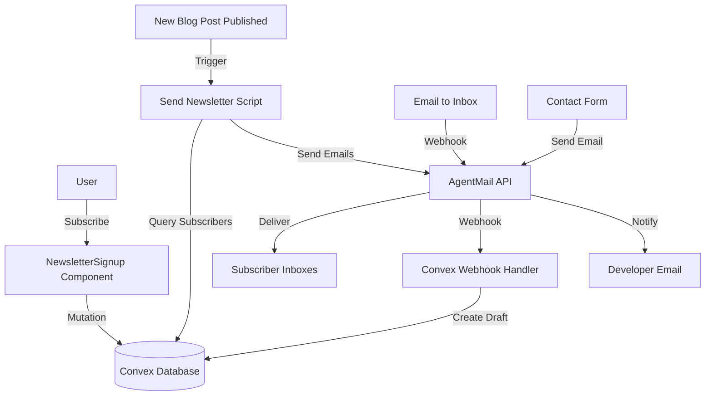

# AgentMail Newsletter Integration Plan

## Overview

Integrate AgentMail as an optional newsletter system with email subscriptions, automated post notifications, email-to-post workflow, and developer notifications. All features are optional and controlled via `siteConfig.ts`.

## Architecture




## Implementation Steps

### Step 1: Database Schema Updates

**File:** `convex/schema.ts`Add two new tables:

```typescript
// Newsletter subscribers
newsletterSubscribers: defineTable({
  email: v.string(),
  name: v.optional(v.string()), // Optional name field
  subscribed: v.boolean(),
  subscribedAt: v.number(),
  unsubscribedAt: v.optional(v.number()),
  source: v.string(), // "home", "post", "newsletter-page"
  unsubscribeToken: v.string(), // For secure unsubscribe links
  lastEmailSentAt: v.optional(v.number()), // Track last notification sent
})
  .index("by_email", ["email"])
  .index("by_subscribed", ["subscribed"]),

// Track which posts have been sent to avoid duplicates
newsletterSentPosts: defineTable({
  postSlug: v.string(),
  sentAt: v.number(),
  sentCount: v.number(), // Number of subscribers notified
})
  .index("by_postSlug", ["postSlug"])
  .index("by_sentAt", ["sentAt"]),

// Email-to-post drafts (for future email-to-post workflow)
emailDrafts: defineTable({
  from: v.string(),
  subject: v.string(),
  content: v.string(), // Markdown content
  attachments: v.optional(v.array(v.string())), // Attachment URLs
  status: v.string(), // "draft", "published", "rejected"
  createdAt: v.number(),
  publishedAt: v.optional(v.number()),
})
  .index("by_status", ["status"])
  .index("by_createdAt", ["createdAt"]),
```


### Step 2: Site Configuration

**File:** `src/config/siteConfig.ts`Add newsletter configuration interface and default config:

```typescript
// Newsletter configuration
export interface NewsletterConfig {
  enabled: boolean; // Master switch - if false, all newsletter features hidden
  agentmail: {
    apiKey?: string; // Stored in env, referenced here for type safety
    inboxUsername: string; // e.g., "newsletter" -> newsletter@agentmail.to
    inboxDomain: string; // e.g., "agentmail.to" or custom domain
    contentInboxUsername?: string; // Separate inbox for email-to-post (optional)
  };
  signup: {
    // Form field configuration
    requireName: boolean; // If true, show name field; if false, email only
    showNameOptional: boolean; // If true, show name as optional field
    
    // Home page signup
    home: {
      enabled: boolean;
      position: "above-footer"; // Only above-footer as requested
      title: string;
      description: string;
    };
    
    // Blog post signup (not pages)
    posts: {
      enabled: boolean;
      position: "below-content"; // Below post content
      title: string;
      description: string;
    };
    
    // Dedicated newsletter page
    page: {
      enabled: boolean;
      slug: string; // e.g., "newsletter"
      title: string;
      description: string;
    };
  };
  notifications: {
    // Auto-send new blog posts
    autoSendNewPosts: boolean; // If true, automatically send when post published
    sendOnSync: boolean; // Send during npm run sync if new post detected
    
    // Email template
    fromName: string;
    fromEmail: string; // Uses inboxUsername@inboxDomain
    replyTo: string; // Optional reply-to address
    includeExcerpt: boolean; // Include post excerpt in email
    includeReadTime: boolean; // Include reading time
  };
  digests: {
    // Weekly/monthly digests (future feature)
    weekly: {
      enabled: boolean;
      dayOfWeek: number; // 0 = Sunday, 6 = Saturday
    };
    monthly: {
      enabled: boolean;
      dayOfMonth: number; // 1-28
    };
  };
  developer: {
    // Developer notifications
    enabled: boolean;
    email: string; // Developer email for notifications
    notifyOnNewSubscriber: boolean;
    notifyOnStats: boolean; // Daily/weekly stats
    statsFrequency: "daily" | "weekly"; // Stats email frequency
  };
  contact: {
    // Contact form via AgentMail
    enabled: boolean;
    inboxUsername: string; // Separate inbox for contact form
  };
}

// Add to SiteConfig interface
export interface SiteConfig {
  // ... existing fields
  newsletter: NewsletterConfig;
}

// Default configuration (all disabled by default)
export const siteConfig: SiteConfig = {
  // ... existing config
  newsletter: {
    enabled: false, // Disabled by default - opt-in
    agentmail: {
      inboxUsername: "newsletter",
      inboxDomain: "agentmail.to",
    },
    signup: {
      requireName: false,
      showNameOptional: true,
      home: {
        enabled: false,
        position: "above-footer",
        title: "Stay Updated",
        description: "Get new posts delivered to your inbox",
      },
      posts: {
        enabled: false,
        position: "below-content",
        title: "Enjoyed this post?",
        description: "Subscribe for more updates",
      },
      page: {
        enabled: false,
        slug: "newsletter",
        title: "Newsletter",
        description: "Subscribe to get updates about new posts and features",
      },
    },
    notifications: {
      autoSendNewPosts: false,
      sendOnSync: false,
      fromName: "Your Site Name",
      fromEmail: "newsletter@agentmail.to",
      replyTo: "",
      includeExcerpt: true,
      includeReadTime: true,
    },
    digests: {
      weekly: { enabled: false, dayOfWeek: 0 },
      monthly: { enabled: false, dayOfMonth: 1 },
    },
    developer: {
      enabled: false,
      email: "",
      notifyOnNewSubscriber: false,
      notifyOnStats: false,
      statsFrequency: "weekly",
    },
    contact: {
      enabled: false,
      inboxUsername: "contact",
    },
  },
};
```


### Step 3: Newsletter Signup Component

**File:** `src/components/NewsletterSignup.tsx`Create reusable signup form component matching existing UI patterns:

```typescript
import { useState } from "react";
import { useMutation } from "convex/react";
import { api } from "../../convex/_generated/api";
import siteConfig from "../config/siteConfig";

interface NewsletterSignupProps {
  variant?: "compact" | "full"; // Compact for inline, full for dedicated page
  source: "home" | "post" | "newsletter-page";
  title?: string; // Override default title
  description?: string; // Override default description
}

export default function NewsletterSignup({
  variant = "compact",
  source,
  title,
  description,
}: NewsletterSignupProps) {
  const [email, setEmail] = useState("");
  const [name, setName] = useState("");
  const [status, setStatus] = useState<"idle" | "loading" | "success" | "error">("idle");
  const [message, setMessage] = useState("");
  const subscribe = useMutation(api.newsletter.subscribe);

  // Get form configuration
  const requireName = siteConfig.newsletter.signup.requireName;
  const showNameOptional = siteConfig.newsletter.signup.showNameOptional;
  const showNameField = requireName || showNameOptional;

  const handleSubmit = async (e: React.FormEvent) => {
    e.preventDefault();
    if (!email || !email.includes("@")) {
      setStatus("error");
      setMessage("Please enter a valid email address");
      return;
    }

    if (requireName && !name.trim()) {
      setStatus("error");
      setMessage("Name is required");
      return;
    }

    setStatus("loading");
    try {
      await subscribe({
        email,
        name: name.trim() || undefined,
        source,
      });
      setStatus("success");
      setMessage("Thanks for subscribing! Check your email to confirm.");
      setEmail("");
      setName("");
    } catch (error) {
      setStatus("error");
      setMessage("Something went wrong. Please try again.");
    }
  };

  if (!siteConfig.newsletter.enabled) return null;

  const config = siteConfig.newsletter.signup[source];
  if (!config.enabled) return null;

  const displayTitle = title || config.title;
  const displayDescription = description || config.description;

  return (
    <div className={`newsletter-signup newsletter-signup--${variant}`}>
      <h3 className="newsletter-signup__title">{displayTitle}</h3>
      {displayDescription && (
        <p className="newsletter-signup__description">{displayDescription}</p>
      )}
      {status === "success" ? (
        <div className="newsletter-signup__success">{message}</div>
      ) : (
        <form onSubmit={handleSubmit} className="newsletter-signup__form">
          {showNameField && (
            <input
              type="text"
              value={name}
              onChange={(e) => setName(e.target.value)}
              placeholder={requireName ? "Your name" : "Your name (optional)"}
              className="newsletter-signup__input"
              required={requireName}
              disabled={status === "loading"}
            />
          )}
          <input
            type="email"
            value={email}
            onChange={(e) => setEmail(e.target.value)}
            placeholder="your@email.com"
            className="newsletter-signup__input"
            required
            disabled={status === "loading"}
          />
          <button
            type="submit"
            className="newsletter-signup__button"
            disabled={status === "loading"}
          >
            {status === "loading" ? "Subscribing..." : "Subscribe"}
          </button>
        </form>
      )}
      {status === "error" && (
        <p className="newsletter-signup__error">{message}</p>
      )}
    </div>
  );
}
```


### Step 4: Convex Newsletter Functions

**File:** `convex/newsletter.ts`Create backend functions following Convex best practices:

```typescript
import { query, mutation, internalMutation, internalAction, action } from "./_generated/server";
import { v } from "convex/values";
import { internal } from "./_generated/api";
import crypto from "crypto";

// Generate unsubscribe token
function generateUnsubscribeToken(email: string): string {
  const secret = process.env.UNSUBSCRIBE_SECRET || "default-secret-change-in-production";
  return crypto.createHash("sha256").update(email + secret).digest("hex").substring(0, 32);
}

// Subscribe to newsletter
export const subscribe = mutation({
  args: {
    email: v.string(),
    name: v.optional(v.string()),
    source: v.string(),
  },
  returns: v.object({
    success: v.boolean(),
    message: v.string(),
  }),
  handler: async (ctx, args) => {
    const email = args.email.toLowerCase().trim();

    // Check if already subscribed
    const existing = await ctx.db
      .query("newsletterSubscribers")
      .withIndex("by_email", (q) => q.eq("email", email))
      .first();

    if (existing && existing.subscribed) {
      return {
        success: false,
        message: "You're already subscribed!",
      };
    }

    const unsubscribeToken = generateUnsubscribeToken(email);

    // Create or update subscriber
    if (existing) {
      // Re-subscribe
      await ctx.db.patch(existing._id, {
        subscribed: true,
        subscribedAt: Date.now(),
        source: args.source,
        name: args.name,
        unsubscribeToken,
        unsubscribedAt: undefined,
      });
    } else {
      // New subscriber
      await ctx.db.insert("newsletterSubscribers", {
        email,
        name: args.name,
        subscribed: true,
        subscribedAt: Date.now(),
        source: args.source,
        unsubscribeToken,
      });
    }

    // Notify developer if enabled (via scheduled action)
    // This will be handled in a separate scheduled function

    return {
      success: true,
      message: "Subscription successful!",
    };
  },
});

// Unsubscribe (public endpoint)
export const unsubscribe = mutation({
  args: {
    email: v.string(),
    token: v.string(),
  },
  returns: v.object({
    success: v.boolean(),
    message: v.string(),
  }),
  handler: async (ctx, args) => {
    const email = args.email.toLowerCase().trim();
    
    const subscriber = await ctx.db
      .query("newsletterSubscribers")
      .withIndex("by_email", (q) => q.eq("email", email))
      .first();

    if (!subscriber) {
      return {
        success: false,
        message: "Email not found in our list.",
      };
    }

    // Verify token
    const expectedToken = generateUnsubscribeToken(email);
    if (subscriber.unsubscribeToken !== args.token) {
      return {
        success: false,
        message: "Invalid unsubscribe link.",
      };
    }

    await ctx.db.patch(subscriber._id, {
      subscribed: false,
      unsubscribedAt: Date.now(),
    });

    return {
      success: true,
      message: "You've been unsubscribed.",
    };
  },
});

// Get subscriber count (for admin/stats)
export const getSubscriberCount = query({
  args: {},
  returns: v.number(),
  handler: async (ctx) => {
    const subscribers = await ctx.db
      .query("newsletterSubscribers")
      .withIndex("by_subscribed", (q) => q.eq("subscribed", true))
      .collect();
    return subscribers.length;
  },
});

// Check if post has been sent (internal query)
export const hasPostBeenSent = internalQuery({
  args: {
    postSlug: v.string(),
  },
  returns: v.boolean(),
  handler: async (ctx, args) => {
    const sent = await ctx.db
      .query("newsletterSentPosts")
      .withIndex("by_postSlug", (q) => q.eq("postSlug", args.postSlug))
      .first();
    return !!sent;
  },
});

// Get active subscribers (internal query)
export const getActiveSubscribers = internalQuery({
  args: {},
  returns: v.array(
    v.object({
      email: v.string(),
      name: v.optional(v.string()),
    }),
  ),
  handler: async (ctx) => {
    const subscribers = await ctx.db
      .query("newsletterSubscribers")
      .withIndex("by_subscribed", (q) => q.eq("subscribed", true))
      .collect();
    
    return subscribers.map((sub) => ({
      email: sub.email,
      name: sub.name,
    }));
  },
});

// Record that post was sent (internal mutation)
export const recordPostSent = internalMutation({
  args: {
    postSlug: v.string(),
    sentCount: v.number(),
  },
  returns: v.id("newsletterSentPosts"),
  handler: async (ctx, args) => {
    // Check if already recorded
    const existing = await ctx.db
      .query("newsletterSentPosts")
      .withIndex("by_postSlug", (q) => q.eq("postSlug", args.postSlug))
      .first();

    if (existing) {
      // Update existing record
      await ctx.db.patch(existing._id, {
        sentAt: Date.now(),
        sentCount: args.sentCount,
      });
      return existing._id;
    }

    // Create new record
    return await ctx.db.insert("newsletterSentPosts", {
      postSlug: args.postSlug,
      sentAt: Date.now(),
      sentCount: args.sentCount,
    });
  },
});

// Send newsletter for a post (internal action)
export const sendPostNewsletter = internalAction({
  args: {
    postSlug: v.string(),
  },
  returns: v.object({
    success: v.boolean(),
    sentCount: v.number(),
    message: v.string(),
  }),
  handler: async (ctx, args) => {
    // Check if already sent
    const alreadySent = await ctx.runQuery(internal.newsletter.hasPostBeenSent, {
      postSlug: args.postSlug,
    });

    if (alreadySent) {
      return {
        success: false,
        sentCount: 0,
        message: "This post has already been sent to subscribers.",
      };
    }

    // Get post details
    const post = await ctx.runQuery(internal.posts.getPostBySlugInternal, {
      slug: args.postSlug,
    });

    if (!post || !post.published) {
      return {
        success: false,
        sentCount: 0,
        message: "Post not found or not published.",
      };
    }

    // Get subscribers
    const subscribers = await ctx.runQuery(internal.newsletter.getActiveSubscribers);

    if (subscribers.length === 0) {
      return {
        success: false,
        sentCount: 0,
        message: "No active subscribers.",
      };
    }

    // Get AgentMail API key
    const apiKey = process.env.AGENTMAIL_API_KEY;
    if (!apiKey) {
      throw new Error("AGENTMAIL_API_KEY not configured");
    }

    // Build email content
    const siteUrl = process.env.SITE_URL || "https://markdown.fast";
    const postUrl = `${siteUrl}/${post.slug}`;
    
    let emailContent = `<h1>${post.title}</h1>`;
    if (post.description) {
      emailContent += `<p>${post.description}</p>`;
    }
    if (post.excerpt) {
      emailContent += `<p>${post.excerpt}</p>`;
    }
    emailContent += `<p><a href="${postUrl}">Read more →</a></p>`;

    // Send emails via AgentMail API
    // Note: Using AgentMail SDK when available
    let sentCount = 0;
    for (const subscriber of subscribers) {
      try {
        // AgentMail API call would go here
        // await agentmailClient.send({
        //   to: subscriber.email,
        //   subject: post.title,
        //   html: emailContent,
        //   from: process.env.AGENTMAIL_FROM_EMAIL,
        // });
        sentCount++;
      } catch (error) {
        console.error(`Failed to send to ${subscriber.email}:`, error);
      }
    }

    // Record that post was sent
    await ctx.runMutation(internal.newsletter.recordPostSent, {
      postSlug: args.postSlug,
      sentCount,
    });

    return {
      success: true,
      sentCount,
      message: `Newsletter sent to ${sentCount} subscribers.`,
    };
  },
});

// Internal query to get post by slug (for newsletter)
export const getPostBySlugInternal = internalQuery({
  args: {
    slug: v.string(),
  },
  returns: v.union(
    v.object({
      slug: v.string(),
      title: v.string(),
      description: v.string(),
      excerpt: v.optional(v.string()),
      published: v.boolean(),
    }),
    v.null(),
  ),
  handler: async (ctx, args) => {
    const post = await ctx.db
      .query("posts")
      .withIndex("by_slug", (q) => q.eq("slug", args.slug))
      .first();
    
    if (!post) return null;
    
    return {
      slug: post.slug,
      title: post.title,
      description: post.description,
      excerpt: post.excerpt,
      published: post.published,
    };
  },
});
```

**File:** `convex/posts.ts`Add internal query for newsletter:

```typescript
// Add to existing posts.ts file
export const getPostBySlugInternal = internalQuery({
  args: { slug: v.string() },
  returns: v.union(/* same as above */),
  handler: async (ctx, args) => {
    // Same implementation as in newsletter.ts
  },
});
```


### Step 5: Newsletter Send Script

**File:** `scripts/send-newsletter.ts`Create script to send newsletters (similar to `sync-posts.ts`):

```typescript
import { ConvexHttpClient } from "convex/browser";
import { internal } from "../convex/_generated/api";
import dotenv from "dotenv";

dotenv.config({ path: ".env.local" });
dotenv.config();

const client = new ConvexHttpClient(process.env.VITE_CONVEX_URL!);

async function sendNewsletterForPost(postSlug: string) {
  try {
    const result = await client.action(internal.newsletter.sendPostNewsletter, {
      postSlug,
    });

    if (result.success) {
      console.log(`✅ ${result.message}`);
      console.log(`📧 Sent to ${result.sentCount} subscribers`);
    } else {
      console.log(`ℹ️  ${result.message}`);
    }
  } catch (error) {
    console.error("❌ Error sending newsletter:", error);
    process.exit(1);
  }
}

// Main execution
const args = process.argv.slice(2);
if (args.length === 0) {
  console.error("Usage: npm run newsletter:send -- <post-slug>");
  console.error("Example: npm run newsletter:send -- my-new-post");
  process.exit(1);
}

const postSlug = args[0];
sendNewsletterForPost(postSlug);
```


### Step 6: Auto-Send Integration with Sync Script

**File:** `scripts/sync-posts.ts`Modify sync script to detect new posts and auto-send if enabled:

```typescript
// Add after syncing posts
async function checkAndSendNewPosts(
  syncedPosts: ParsedPost[],
  client: ConvexHttpClient,
) {
  // Check if auto-send is enabled (would need to query config)
  // For now, check environment variable
  const autoSend = process.env.AGENTMAIL_AUTO_SEND === "true";
  if (!autoSend) return;

  // Get all synced post slugs
  const syncedSlugs = syncedPosts
    .filter((p) => p.published)
    .map((p) => p.slug);

  // Check which posts haven't been sent yet
  for (const slug of syncedSlugs) {
    try {
      const alreadySent = await client.query(
        internal.newsletter.hasPostBeenSent,
        { postSlug: slug },
      );

      if (!alreadySent) {
        console.log(`\n📧 Sending newsletter for new post: ${slug}`);
        await client.action(internal.newsletter.sendPostNewsletter, {
          postSlug: slug,
        });
      }
    } catch (error) {
      console.error(`Error sending newsletter for ${slug}:`, error);
    }
  }
}

// Call this after syncPostsPublic in main function
await checkAndSendNewPosts(parsedPosts, client);
```


### Step 7: Newsletter Page

**File:** `content/pages/newsletter.md`Create dedicated newsletter signup page:

```markdown
---
title: "Newsletter"
slug: "newsletter"
published: true
order: 5
showInNav: true
---

Subscribe to get updates about new posts, features, and developments.

[NewsletterSignup component will render here]
```

**File:** `src/pages/Post.tsx`Modify to render NewsletterSignup component for newsletter page:

```typescript
// In Post.tsx, after checking if it's a page
if (page && page.slug === siteConfig.newsletter.signup.page.slug) {
  // Render newsletter signup page
  return (
    <div className="post-page">
      {/* ... existing page rendering ... */}
      <NewsletterSignup
        variant="full"
        source="newsletter-page"
      />
    </div>
  );
}
```


### Step 8: Unsubscribe Page

**File:** `src/pages/Unsubscribe.tsx`Create unsubscribe page:

```typescript
import { useSearchParams, useNavigate } from "react-router-dom";
import { useMutation } from "convex/react";
import { api } from "../../convex/_generated/api";
import { useState, useEffect } from "react";

export default function Unsubscribe() {
  const [searchParams] = useSearchParams();
  const navigate = useNavigate();
  const email = searchParams.get("email");
  const token = searchParams.get("token");
  const unsubscribeMutation = useMutation(api.newsletter.unsubscribe);
  const [status, setStatus] = useState<"loading" | "success" | "error" | "idle">("idle");
  const [message, setMessage] = useState("");

  useEffect(() => {
    if (email && token) {
      handleUnsubscribe();
    }
  }, [email, token]);

  const handleUnsubscribe = async () => {
    if (!email || !token) {
      setStatus("error");
      setMessage("Invalid unsubscribe link.");
      return;
    }

    setStatus("loading");
    try {
      const result = await unsubscribeMutation({ email, token });
      setStatus(result.success ? "success" : "error");
      setMessage(result.message);
    } catch (error) {
      setStatus("error");
      setMessage("An error occurred. Please try again.");
    }
  };

  return (
    <div className="unsubscribe-page">
      <h1>Unsubscribe</h1>
      {status === "loading" && <p>Processing...</p>}
      {status === "success" && (
        <>
          <p>{message}</p>
          <button onClick={() => navigate("/")} className="back-button">
            Back to home
          </button>
        </>
      )}
      {status === "error" && <p>{message}</p>}
      {status === "idle" && (
        <p>Use the unsubscribe link from your email to unsubscribe.</p>
      )}
    </div>
  );
}
```

**File:** `src/App.tsx`Add unsubscribe route:

```typescript
// Add route
<Route path="/unsubscribe" element={<Unsubscribe />} />
```


### Step 9: Integration Points

**File:** `src/pages/Home.tsx`Add newsletter signup above footer:

```typescript
// Before footer section
{siteConfig.newsletter.enabled &&
  siteConfig.newsletter.signup.home.enabled &&
  siteConfig.newsletter.signup.home.position === "above-footer" && (
    <NewsletterSignup
      variant="compact"
      source="home"
    />
  )}

{/* Footer section */}
<section className="home-footer">
  {/* ... existing footer ... */}
</section>
```

**File:** `src/pages/Post.tsx`Add newsletter signup below post content (only for posts, not pages):

```typescript
// After BlogPost content, before footer
{post && // Only for posts, not pages
  siteConfig.newsletter.enabled &&
  siteConfig.newsletter.signup.posts.enabled && (
    <NewsletterSignup
      variant="compact"
      source="post"
    />
  )}

<footer className="post-footer">
  {/* ... existing footer ... */}
</footer>
```


### Step 10: Webhook Handler (Future Email-to-Post)

**File:** `convex/webhooks.ts`Create webhook handler for AgentMail events:

```typescript
import { httpAction } from "./_generated/server";
import { internal } from "./_generated/api";

export const agentmailWebhook = httpAction(async (ctx, request) => {
  // Verify webhook signature from AgentMail
  const signature = request.headers.get("x-agentmail-signature");
  // Add signature verification logic here

  const body = await request.json();
  
  // Handle different event types
  if (body.type === "message.received") {
    // Process incoming email for email-to-post workflow
    await ctx.runMutation(internal.newsletter.handleIncomingEmail, {
      from: body.from,
      subject: body.subject,
      content: body.content,
      attachments: body.attachments || [],
      inboxId: body.inbox_id,
    });
  }

  return new Response(JSON.stringify({ received: true }), {
    status: 200,
    headers: { "Content-Type": "application/json" },
  });
});
```

**File:** `convex/newsletter.ts`Add handler for incoming emails:

```typescript
// Handle incoming email (for email-to-post workflow)
export const handleIncomingEmail = internalMutation({
  args: {
    from: v.string(),
    subject: v.string(),
    content: v.string(),
    attachments: v.array(v.string()),
    inboxId: v.string(),
  },
  returns: v.id("emailDrafts"),
  handler: async (ctx, args) => {
    // Parse subject for tags like [draft] or [publish]
    const subjectLower = args.subject.toLowerCase();
    const isDraft = subjectLower.includes("[draft]");
    const isPublish = subjectLower.includes("[publish]");
    
    const status = isPublish ? "published" : isDraft ? "draft" : "draft";

    // Create draft post
    return await ctx.db.insert("emailDrafts", {
      from: args.from,
      subject: args.subject,
      content: args.content, // Markdown content
      attachments: args.attachments,
      status,
      createdAt: Date.now(),
    });
  },
});
```

**File:** `convex/http.ts`Add webhook route:

```typescript
import { agentmailWebhook } from "./webhooks";

// Add route
http.route({
  path: "/webhooks/agentmail",
  method: "POST",
  handler: agentmailWebhook,
});
```


### Step 11: Package.json and Environment Variables

**File:** `package.json`Add newsletter scripts:

```json
{
  "scripts": {
    "newsletter:send": "npx tsx scripts/send-newsletter.ts",
    "sync": "npx tsx scripts/sync-posts.ts"
  }
}
```

**File:** `.env.local.example`Add AgentMail environment variables:

```bash
# AgentMail Configuration (optional)
AGENTMAIL_API_KEY=your_api_key_here
AGENTMAIL_INBOX_USERNAME=newsletter
AGENTMAIL_INBOX_DOMAIN=agentmail.to
AGENTMAIL_AUTO_SEND=false
AGENTMAIL_FROM_EMAIL=newsletter@agentmail.to
UNSUBSCRIBE_SECRET=change-this-in-production
```


### Step 12: CSS Styling

**File:** `src/styles/global.css`Add newsletter component styles matching existing theme:

```css
/* Newsletter Signup Component */
.newsletter-signup {
  margin: 2rem 0;
  padding: 1.5rem;
  border: 1px solid var(--border-color);
  border-radius: 8px;
  background: var(--bg-secondary);
}

.newsletter-signup__title {
  font-size: var(--font-size-xl);
  margin-bottom: 0.5rem;
  color: var(--text-primary);
}

.newsletter-signup__description {
  font-size: var(--font-size-base);
  color: var(--text-secondary);
  margin-bottom: 1rem;
}

.newsletter-signup__form {
  display: flex;
  flex-direction: column;
  gap: 0.75rem;
}

.newsletter-signup__input {
  padding: 0.75rem;
  font-size: var(--font-size-base);
  border: 1px solid var(--border-color);
  border-radius: 4px;
  background: var(--bg-primary);
  color: var(--text-primary);
}

.newsletter-signup__button {
  padding: 0.75rem 1.5rem;
  font-size: var(--font-size-md);
  background: var(--accent-color);
  color: var(--text-on-accent);
  border: none;
  border-radius: 4px;
  cursor: pointer;
  transition: opacity 0.2s;
}

.newsletter-signup__button:hover:not(:disabled) {
  opacity: 0.9;
}

.newsletter-signup__button:disabled {
  opacity: 0.6;
  cursor: not-allowed;
}

.newsletter-signup__success {
  padding: 0.75rem;
  background: var(--success-bg, #d4edda);
  color: var(--success-text, #155724);
  border-radius: 4px;
}

.newsletter-signup__error {
  color: var(--error-color, #dc3545);
  font-size: var(--font-size-sm);
  margin-top: 0.5rem;
}

/* Unsubscribe Page */
.unsubscribe-page {
  max-width: 600px;
  margin: 2rem auto;
  padding: 2rem;
}

.unsubscribe-page h1 {
  font-size: var(--font-size-3xl);
  margin-bottom: 1rem;
}
```


### Step 13: Fork Configuration

**File:** `fork-config.json.example`Add newsletter configuration:

```json
{
  "newsletter": {
    "enabled": false,
    "agentmail": {
      "inboxUsername": "newsletter",
      "inboxDomain": "agentmail.to"
    },
    "signup": {
      "requireName": false,
      "showNameOptional": true,
      "home": {
        "enabled": false,
        "position": "above-footer",
        "title": "Stay Updated",
        "description": "Get new posts delivered to your inbox"
      },
      "posts": {
        "enabled": false,
        "position": "below-content",
        "title": "Enjoyed this post?",
        "description": "Subscribe for more updates"
      },
      "page": {
        "enabled": false,
        "slug": "newsletter",
        "title": "Newsletter",
        "description": "Subscribe to get updates"
      }
    },
    "notifications": {
      "autoSendNewPosts": false,
      "sendOnSync": false,
      "fromName": "Your Site Name",
      "fromEmail": "newsletter@agentmail.to"
    }
  }
}
```

**File:** `FORK_CONFIG.md`Add newsletter configuration section:

```markdown
## Newsletter Configuration

The newsletter feature is optional and disabled by default. To enable:

1. Set `newsletter.enabled: true` in `siteConfig.ts`
2. Add `AGENTMAIL_API_KEY` to `.env.local`
3. Configure signup forms in `siteConfig.newsletter.signup`
4. Optionally enable auto-send for new posts

See `prds/agentmailplan-v1.md` for full documentation.
```


## Future Features (Not in Initial Implementation)

These features are planned but not included in steps 1-11:

- Weekly/monthly digest emails (cron jobs)
- Developer notifications (stats summaries, new subscriber alerts)
- Contact form via AgentMail
- Email-to-post workflow (webhook handler created, but full workflow deferred)
- Email replies/comments
- RSS feed validation alerts

These can be added incrementally after the core newsletter functionality is working.

## Testing Checklist

- [ ] Newsletter signup form appears on home page (above footer) when enabled
- [ ] Newsletter signup form appears on blog posts (below content) when enabled
- [ ] Newsletter signup form appears on dedicated newsletter page
- [ ] Name field shows/hides based on configuration
- [ ] Subscription saves to Convex database
- [ ] Unsubscribe link works with token verification
- [ ] `npm run newsletter:send -- <slug>` sends email to all subscribers
- [ ] Auto-send works during `npm run sync` if enabled