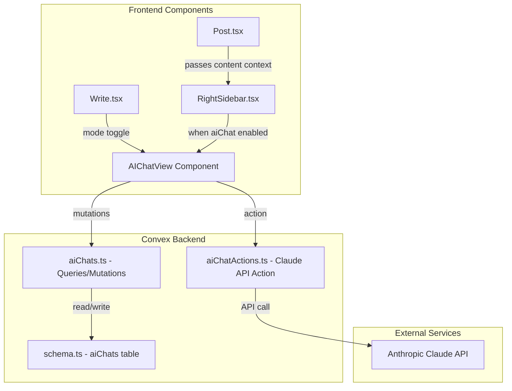

# AI Chat Write Agent Implementation

## Architecture Overview




## Key Design Decisions

- **Anonymous Sessions**: Uses localStorage `sessionId` (UUID) until auth is added
- **Chat Scope**: Per-page using slug as context identifier (e.g., "write-page", "about", "my-post-slug")
- **Page Context**: Optional button to load current page's markdown into chat context
- **Mode Toggle**: Write page switches between textarea and chat interface
- **Configuration**: Separate siteConfig toggles for Write page and RightSidebar

---

## 1. Database Schema Updates

Update [`convex/schema.ts`](convex/schema.ts) to add the `aiChats` table:

```typescript
aiChats: defineTable({
  sessionId: v.string(),
  contextId: v.string(), // slug or "write-page"
  messages: v.array(
    v.object({
      role: v.union(v.literal("user"), v.literal("assistant")),
      content: v.string(),
      timestamp: v.number(),
    }),
  ),
  pageContext: v.optional(v.string()), // loaded page content
  lastMessageAt: v.optional(v.number()),
})
  .index("by_session_and_context", ["sessionId", "contextId"])
  .index("by_session", ["sessionId"])
```

---

## 2. Convex Backend

### Create [`convex/aiChats.ts`](convex/aiChats.ts)

Queries and mutations for chat management:

- `getAIChatByContext` - Fetch chat for sessionId + contextId
- `getOrCreateAIChat` - Create chat if none exists
- `addUserMessage` - Add user message
- `addAssistantMessage` - Internal mutation for AI response
- `clearChat` - Clear messages
- `setPageContext` - Store loaded page content

### Create [`convex/aiChatActions.ts`](convex/aiChatActions.ts)

Node.js action for Claude API:

- `generateResponse` - Calls Claude API with conversation history
- Uses `ANTHROPIC_API_KEY` environment variable
- Loads system prompt from `CLAUDE_SYSTEM_PROMPT` or split `CLAUDE_PROMPT_*` variables
- Model: `claude-sonnet-4-20250514` with 2048 max tokens
- Includes last 20 messages as context

---

## 3. Frontend Components

### Create [`src/components/AIChatView.tsx`](src/components/AIChatView.tsx)

Main chat component with:

- Message list with markdown rendering (react-markdown)
- Auto-expanding textarea input
- Send button and keyboard shortcuts (Enter to send, Shift+Enter newline)
- Loading state with stop generation button
- Clear chat command ("clear")
- Copy message button on AI responses
- "Load Page Content" button (when page content available)
- Theme-aware styling matching existing UI

### Update [`src/components/RightSidebar.tsx`](src/components/RightSidebar.tsx)

Transform from empty placeholder to conditional chat container:

- Accept `aiChatEnabled`, `pageContent`, and `slug` props
- Render `AIChatView` when enabled
- Pass page context for "Load Content" feature

---

## 4. Page Updates

### Update [`src/pages/Write.tsx`](src/pages/Write.tsx)

Add AI chat mode toggle:

- New state: `isAIChatMode` (boolean)
- Add "AI Chat" button in Actions section (using `ChatCircle` from Phosphor Icons)
- When active: replace `<textarea>` with `<AIChatView contextId="write-page" />`
- Show "Back to Editor" button to switch back
- Respect `siteConfig.aiChat.enabledOnWritePage` setting

### Update [`src/pages/Post.tsx`](src/pages/Post.tsx)

Pass content to RightSidebar:

- Check `siteConfig.aiChat.enabledOnContent` AND frontmatter `aiChat: true`
- Pass `pageContent={content}` and `slug` to RightSidebar
- Add new frontmatter field `aiChat` to field definitions

---

## 5. Configuration

### Update [`src/config/siteConfig.ts`](src/config/siteConfig.ts)

Add AI chat configuration interface and defaults:

```typescript
export interface AIChatConfig {
  enabledOnWritePage: boolean;  // Show AI chat on /write
  enabledOnContent: boolean;    // Allow AI chat on posts/pages via frontmatter
}

// In SiteConfig interface:
aiChat: AIChatConfig;

// Default values:
aiChat: {
  enabledOnWritePage: true,
  enabledOnContent: true,
},
```


### Update Frontmatter Fields

Add `aiChat` field to sync scripts and field definitions:

- [`scripts/sync-posts.ts`](scripts/sync-posts.ts) - Add to PostFrontmatter and PageFrontmatter
- [`src/pages/Write.tsx`](src/pages/Write.tsx) - Add to POST_FIELDS and PAGE_FIELDS

---

## 6. Styling

### Update [`src/styles/global.css`](src/styles/global.css)

Add AI chat styles (approximately 300-400 lines):

- `.ai-chat-view` - Main container
- `.ai-chat-messages` - Scrollable message list
- `.ai-chat-message`, `.ai-chat-message-user`, `.ai-chat-message-assistant`
- `.ai-chat-input-container`, `.ai-chat-input`, `.ai-chat-send-button`
- `.ai-chat-loading`, `.ai-chat-stop-button`
- `.ai-chat-copy-button`, `.ai-chat-clear-button`
- `.ai-chat-load-context-button`
- Theme variants for dark, light, tan, cloud
- Mobile responsive styles

---

## 7. Dependencies

### Update [`package.json`](package.json)

Add required packages:

```json
"@anthropic-ai/sdk": "^0.71.2"
```

Note: `react-markdown` and `remark-gfm` already exist in the project.---

## 8. Environment Variables

Add to Convex deployment:

- `ANTHROPIC_API_KEY` (required) - Claude API key
- `CLAUDE_SYSTEM_PROMPT` (optional) - Custom system prompt for writing assistant

---

## File Summary