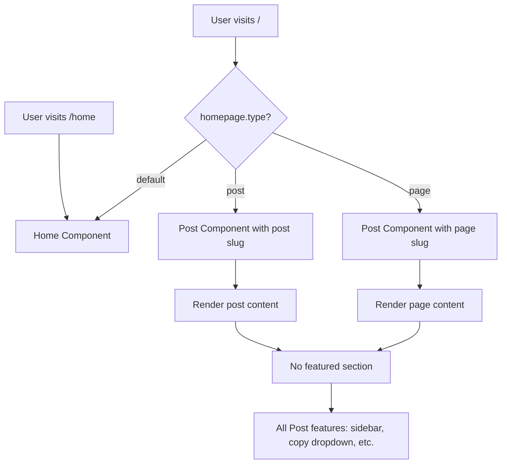

# Cus

tom Homepage ConfigurationAllow configuring any page or blog post to serve as the homepage while preserving all Post component features (sidebar, copy dropdown, author info, etc.) and using the page/post's metadata for SEO.

## Architecture Overview




## Implementation Steps

### 1. Update `src/config/siteConfig.ts`

Add homepage configuration interface and default:

```typescript
// Add to SiteConfig interface
export interface HomepageConfig {
  type: "default" | "page" | "post";
  slug?: string; // Required if type is "page" or "post"
  originalHomeRoute?: string; // Route to access original homepage (default: "/home")
}

export interface SiteConfig {
  // ... existing fields ...
  homepage: HomepageConfig;
}

// Add to siteConfig object
export const siteConfig: SiteConfig = {
  // ... existing config ...
  homepage: {
    type: "default", // Options: "default", "page", "post"
    slug: undefined, // e.g., "about" or "welcome-post"
    originalHomeRoute: "/home", // Route to access original homepage
  },
};
```


### 2. Update `src/App.tsx`

Modify routing to conditionally render homepage:

```typescript
function App() {
  usePageTracking();
  const location = useLocation();

  if (location.pathname === "/write") {
    return <Write />;
  }

  // Determine if we should use a custom homepage
  const useCustomHomepage = 
    siteConfig.homepage.type !== "default" && 
    siteConfig.homepage.slug;

  return (
    <SidebarProvider>
      <Layout>
        <Routes>
          {/* Homepage route - either default Home or custom page/post */}
          <Route 
            path="/" 
            element={
              useCustomHomepage ? (
                <Post 
                  slug={siteConfig.homepage.slug!} 
                  isHomepage={true}
                  homepageType={siteConfig.homepage.type}
                />
              ) : (
                <Home />
              )
            } 
          />
          
          {/* Original homepage route (when custom homepage is set) */}
          {useCustomHomepage && (
            <Route 
              path={siteConfig.homepage.originalHomeRoute || "/home"} 
              element={<Home />} 
            />
          )}
          
          {/* ... rest of routes ... */}
        </Routes>
      </Layout>
    </SidebarProvider>
  );
}
```


### 3. Update `src/pages/Post.tsx`

Add props to support homepage mode and hide back button:

```typescript
interface PostProps {
  slug?: string; // Optional slug prop when used as homepage
  isHomepage?: boolean; // Flag to indicate this is the homepage
  homepageType?: "page" | "post"; // Type of homepage content
}

export default function Post({ 
  slug: propSlug, 
  isHomepage = false,
  homepageType 
}: PostProps = {}) {
  const { slug: routeSlug } = useParams<{ slug: string }>();
  const slug = propSlug || routeSlug;
  
  // ... existing queries ...
  
  // Conditionally hide back button when used as homepage
  // In the render section:
  {!isHomepage && (
    <button onClick={() => navigate("/")} className="back-button">
      <ArrowLeft size={16} />
      <span>Back</span>
    </button>
  )}
  
  // ... rest of component unchanged ...
}
```


### 4. Update `scripts/configure-fork.ts`

Add homepage configuration support:

```typescript
interface ForkConfig {
  // ... existing fields ...
  homepage?: {
    type: "default" | "page" | "post";
    slug?: string;
    originalHomeRoute?: string;
  };
}

// Add update function
function updateSiteConfig(config: ForkConfig): void {
  // ... existing updates ...
  
  if (config.homepage) {
    const homepageConfig = JSON.stringify(config.homepage, null, 2)
      .replace(/"/g, '"')
      .replace(/\n/g, '\n    ');
    
    updateFile(
      "src/config/siteConfig.ts",
      [
        {
          search: /homepage:\s*\{[^}]*\},/s,
          replace: `homepage: ${homepageConfig},`,
        },
      ]
    );
  }
}
```


### 5. Update `FORK_CONFIG.md`

Add homepage configuration section:

````markdown
## Homepage Configuration

You can set any page or blog post to serve as your homepage.

### In fork-config.json

```json
{
  "homepage": {
    "type": "page",
    "slug": "about",
    "originalHomeRoute": "/home"
  }
}
````

Options:

- `type`: `"default"` (standard homepage), `"page"` (use a static page), or `"post"` (use a blog post)
- `slug`: The slug of the page or post to use (required if type is "page" or "post")
- `originalHomeRoute`: Route to access the original homepage (default: "/home")

### Manual Configuration

In `src/config/siteConfig.ts`:

```typescript
homepage: {
  type: "page", // or "post" or "default"
  slug: "about", // slug of page/post to use
  originalHomeRoute: "/home", // route to original homepage
},
```


### Notes

- Custom homepage uses the page/post's full content and features (sidebar, copy dropdown, etc.)
- Featured section is NOT shown on custom homepage
- SEO metadata comes from the page/post's frontmatter
- Original homepage remains accessible at `/home` when custom homepage is set
````javascript

### 6. Update `fork-config.json.example`

Add homepage configuration example:

```json
{
  "homepage": {
    "type": "default",
    "slug": null,
    "originalHomeRoute": "/home"
  }
}
````


## Files to Modify

1. `src/config/siteConfig.ts` - Add HomepageConfig interface and default config
2. `src/App.tsx` - Conditional homepage routing
3. `src/pages/Post.tsx` - Add props for homepage mode, hide back button
4. `scripts/configure-fork.ts` - Add homepage config parsing and file updates
5. `FORK_CONFIG.md` - Document homepage configuration
6. `fork-config.json.example` - Add homepage config example

## Behavior Details

### Custom Homepage (page/post)

- Renders using Post component with all features
- Shows page/post content with markdown rendering
- Includes sidebar if `layout: "sidebar"` in frontmatter
- Includes copy dropdown, author info, tags (for posts)
- Does NOT show back button
- Does NOT show featured section
- Uses page/post metadata for SEO (title, description, OG image)

### Original Homepage

- Remains accessible at `/home` (or configured route)
- Shows all standard features (featured section, posts list, etc.)
- Unchanged functionality

### Default Behavior

- When `homepage.type === "default"`, standard Home component renders at `/`
- No `/home` route is created

## Testing Checklist

- [ ] Default homepage works at `/`
- [ ] Custom page homepage renders at `/` with all Post features
- [ ] Custom post homepage renders at `/` with all Post features
- [ ] Back button hidden on custom homepage
- [ ] Featured section not shown on custom homepage
- [ ] Original homepage accessible at `/home` when custom homepage set
- [ ] SEO metadata uses page/post frontmatter
- [ ] Sidebar works on custom homepage if layout is "sidebar"