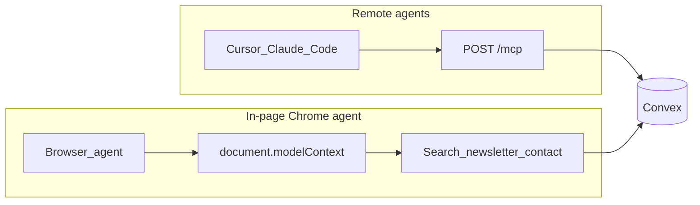

# First-party WebMCP for in-page agents

## Decision

Keep [`convex/mcp.ts`](convex/mcp.ts) as the remote agent API (Cursor, Claude Code, blogskill). Add a small in-page WebMCP layer for Chrome agents that already have a tab open. Do not enable Cloudflare Agent Readiness packs. Do not register `create_draft` or `export_all` in the browser.

WebMCP is a progressive enhancement. If `document.modelContext` (or the Chrome testing surface) is missing, the site is unchanged.

## Out of scope for v1

- Cloudflare `mcp-server-client` / C2PA packs and HTMLRewriter injection
- Dashboard admin tools (`open_dashboard_section`, publish, API keys)
- `create_draft` and `export_all` as in-page tools
- Origin trial token in code until Wayne registers the Chrome trial (docs will say how)

## 1. PRD and task tracking

Write [`prds/webmcp-in-page-tools.md`](prds/webmcp-in-page-tools.md) from the create-prd template (problem, solution, files, edge cases, verification, UTC timestamps). Add checkable items under `## To Do` in [`TASK.md`](TASK.md).

## 2. Tool catalog and MCP list split

Add a shared catalog in `src/utils/webmcp/catalog.ts` (names, descriptions, JSON schemas, `audience: "page" | "remote-public" | "remote-pipeline"`).

Change [`convex/mcp.ts`](convex/mcp.ts) so `tools/list` omits `create_draft` unless a pipeline key is present. Public crawlers and any future browser proxy then cannot advertise a privileged tool. Clients that already send `x-api-key` still see eight tools. Update the dashboard MCP docs curl note (today it says you should always see eight tools).

## 3. Browser adapter and provider

New files:

- `src/utils/webmcp/detect.ts` — feature detect `document.modelContext`, fall back to Chrome testing `navigator.modelContextTesting` for the local flag
- `src/utils/webmcp/register.ts` — register/unregister, ignore failures
- `src/hooks/useWebMcp.ts` — route-scoped registration
- `src/components/WebMcpProvider.tsx` — mount from [`src/components/Layout.tsx`](src/components/Layout.tsx) (already owns search and Ask AI). Skip `/dashboard`.

Dev dependency: `webmcp-types`. Reference it in [`tsconfig.json`](tsconfig.json) via `"types": ["webmcp-types"]` or a triple-slash in the detect file so DOM types stay intact.

v1 tools (only if `siteConfig.webmcp.enabled` and the API exists):

- `search_site` — open [`SearchModal.tsx`](src/components/SearchModal.tsx) with the query (add an `initialQuery` prop; Layout already has `openSearch`)
- `get_current_page` — slug, title, description from the current route (published only)
- `open_post` / `open_page` — `navigate` to a published slug; refuse unlisted
- `list_recent_posts` — small metadata list via existing public query, not `export_all`
- `set_theme` — existing theme toggle
- `subscribe_newsletter` — only when the newsletter form is on the page; fill + submit the real [`NewsletterSignup.tsx`](src/components/NewsletterSignup.tsx) path (honeypot stays empty)
- `submit_contact` — same for [`ContactForm.tsx`](src/components/ContactForm.tsx)

Writes (`subscribe_newsletter`, `submit_contact`) pause on a site-styled confirm dialog (reuse modal patterns from [`EmbedDialog.tsx`](src/components/EmbedDialog.tsx) / dashboard modals). Never `window.confirm`.

Post-route only, if the player is shown: `listen_to_post` clicks play on [`PostAudioPlayer.tsx`](src/components/PostAudioPlayer.tsx) via a small callback/ref. Skip if audio is off.

Unregister and re-register on route change so the tool list matches the page.

## 4. Config flag

Add `webmcp: { enabled: boolean }` to [`src/config/siteConfig.ts`](src/config/siteConfig.ts), default `true`. Mirror the checkbox in Dashboard ConfigSection next to Ask AI / semantic search in [`src/pages/Dashboard.tsx`](src/pages/Dashboard.tsx) (`askAIEnabled` around line 8045 is the pattern). Runtime overrides already deep-merge via [`src/config/runtimeConfig.ts`](src/config/runtimeConfig.ts).

## 5. Dashboard docs (required)

New topic `webmcp`, title `WebMCP in the browser`, in [`src/components/dashboard/docsTopics.ts`](src/components/dashboard/docsTopics.ts). Group it under Agents and automation in [`src/components/DashboardDocsSection.tsx`](src/components/DashboardDocsSection.tsx) as `["publish", "agents", "mcp", "webmcp", "agent-ready"]`, with a Plug or Broadcast icon.

Docs copy must say, in order:

- What it is: Chrome in-page tools on the live site, human watching
- What it is not: not a replacement for `POST /mcp`
- How to test locally: `chrome://flags/#enable-webmcp-testing`, Model Context Tool Inspector, then `search_site`
- Tool table for the in-page allowlist
- Never: `create_draft`, `export_all`, dashboard writes, Cloudflare Site MCP Server pack
- Origin trial: register at Chrome origin trials for `https://waynesutton.ai` when you want it for real visitors; until then only the local flag works
- Deep link: `?docs=webmcp`

Cross-links:

- Overview loop in the same file: agents can read with no auth, write drafts with a pipeline key, and (in Chrome) call in-page tools
- MCP topic: contrast remote vs in-page; document the new `tools/list` behavior
- Drafts Inbox / Publish from agents: one line that WebMCP does not submit drafts
- [`src/utils/dashboardSearch.ts`](src/utils/dashboardSearch.ts): add a FEATURE_ENTRIES row for WebMCP pointing at `docsTopic: "webmcp"`. Doc body search already indexes new topics.

Optional one-liners (same meaning, keep short): [`agent-ready.config.json`](agent-ready.config.json) `agentInstructions`, [`AGENTS.md`](AGENTS.md). Do not rewrite the MCP HTTP docs as if they moved.

## 6. Tests and verification

- Vitest: catalog audience filters; `create_draft` is not in the page allowlist; search ranking finds "webmcp"
- Typecheck and lint
- Browser: Chrome with the flag. Public home: list tools, `search_site`, `get_current_page`. A post URL: `open_post` / `listen_to_post` if audio shows. Newsletter/contact: confirm dialog, then real submit. `/dashboard`: no tools registered. Chrome without the flag: no errors, site works.

## 7. Project docs after ship

Update [`TASK.md`](TASK.md), [`changelog.md`](changelog.md) (real date from `git log --date=short -n 10`), [`files.md`](files.md) for new `src/utils/webmcp/` and `WebMcpProvider`.

Do not commit unless asked.
