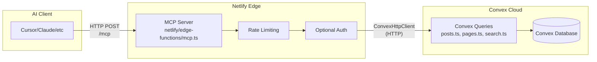

# HTTP-Based MCP Server on Netlify Plan

## Overview

Deploy an HTTP-based MCP server as a Netlify Edge Function that's accessible 24/7 at `https://www.waynesutton.ai/mcp`. The server uses optional authentication (public access by default with rate limiting, API key authentication for higher limits) and exposes read-only tools for AI tools like Cursor to access blog content.

## Architecture



## Key Differences from Local Server

- **HTTP Transport**: Uses HTTP instead of stdio (accessible remotely)
- **Netlify Deployment**: Runs on Netlify Edge Functions (always available) https://docs.netlify.com/build/edge-functions/overview/
- **Optional Authentication**: Public access with rate limiting, API key for higher limits
- **No Local Machine**: Accessible from anywhere, no laptop needed

## Implementation Steps

### 1. Add MCP SDK Dependency

**File:** `package.json`

- Add `@modelcontextprotocol/sdk` to dependencies
- Version: Use latest stable version
- No local script needed (runs on Netlify)

### 2. Create MCP Edge Function

**New File:** `netlify/edge-functions/mcp.ts`

**Key Components:**

- Import MCP SDK: `@modelcontextprotocol/sdk`
- Use `ConvexHttpClient` pattern (similar to `api.ts` edge function)
- Read `VITE_CONVEX_URL` from Netlify environment variables
- Implement HTTP transport for MCP protocol
- Handle JSON-RPC requests/responses over HTTP
- Support optional authentication via `Authorization` header

**MCP Tools to Implement:**

1. **`list_posts`** - Get all published posts
   - Calls: `api.posts.getAllPosts`
   - Returns: Array of post metadata (no content)

2. **`get_post`** - Get single post by slug with full content
   - Args: `slug: string`
   - Calls: `api.posts.getPostBySlug`
   - Returns: Full post object with content

3. **`list_pages`** - Get all published pages
   - Calls: `api.pages.getAllPages`
   - Returns: Array of page metadata (no content)

4. **`get_page`** - Get single page by slug with full content
   - Args: `slug: string`
   - Calls: `api.pages.getPageBySlug`
   - Returns: Full page object with content

5. **`get_homepage`** - Get homepage structure and featured content
   - Calls: `api.posts.getFeaturedPosts`, `api.pages.getFeaturedPages`, `api.posts.getAllPosts` (limited)
   - Returns: Combined homepage data structure

6. **`search_content`** - Full text search across posts and pages
   - Args: `query: string`
   - Calls: `api.search.search`
   - Returns: Search results with snippets

7. **`export_all`** - Batch export all posts and pages with full content
   - Calls: Multiple queries to get all content
   - Returns: Complete content export

**Rate Limiting:**

- Use Netlify's built-in rate limiting (not in-memory)
- Configure in edge function `config` export using `rateLimit` property
- Public access: 50 requests/minute per IP address
- Authenticated access: 1000 requests/minute per API key
- Reference: [Netlify Rate Limiting Docs](https://docs.netlify.com/manage/security/secure-access-to-sites/rate-limiting/)
- Use `aggregateBy: ["ip", "domain"]` for public rate limiting
- Use separate rate limit rules for authenticated vs public access

**Optional Authentication:**

- Check for `Authorization: Bearer <key>` header
- If no header: Public access with lower rate limits
- If valid API key: Higher rate limits
- API key stored in Netlify environment variable `MCP_API_KEY`
- Return 401 if invalid API key provided

**Error Handling:**

- Validate Convex URL is set
- Handle Convex query errors gracefully
- Return proper MCP JSON-RPC error responses
- Never expose internal errors or stack traces
- Log errors to console (Netlify logs)

### 3. Configure Netlify

**File:** `netlify.toml`

Add edge function configuration (rate limiting configured in function code, not here):

```toml
[[edge_functions]]
  path = "/mcp"
  function = "mcp"
```

**Note**: Rate limiting is configured in the edge function's `config` export, not in `netlify.toml`. See [Netlify Rate Limiting Docs](https://docs.netlify.com/manage/security/secure-access-to-sites/rate-limiting/) for code-based rules.

**Environment Variables (Netlify Dashboard):**

- `VITE_CONVEX_URL` - Already exists
- `MCP_API_KEY` - Optional, for authenticated access (generate secure random key)

### 4. Create Blog Post with Usage Instructions

**New File:** `content/blog/how-to-use-mcp-server.md`

**Content Sections:**

- What is MCP and why use it
- HTTP-based vs local server comparison
- Public access (no authentication needed)
- Optional API key setup (for higher limits)
- Client configuration examples (Cursor, Claude, etc.)
- Available tools reference
- Rate limiting details
- Troubleshooting common issues
- Security considerations

**Frontmatter:**

```yaml
title: "How to Use the MCP Server"
description: "Guide to using the HTTP-based Model Context Protocol server at www.markdown.fast/mcp with Cursor and other AI tools"
date: "2025-12-28"
slug: "how-to-use-mcp-server"
published: true
tags: ["mcp", "cursor", "ai", "tutorial", "netlify"]
```

### 5. Update Documentation Files

**File:** `content/pages/docs.md`

Add new section "MCP Server" after "API Endpoints" section:

- Overview of HTTP-based MCP server
- Endpoint URL: `https://www.waynesutton.ai/mcp`
- Public access (no authentication required)
- Optional API key setup
- Rate limiting information
- Available tools list with descriptions
- Client configuration examples
- Link to detailed blog post

**File:** `content/blog/setup-guide.md`

Add subsection under "Next Steps" or create new section:

- Brief mention of HTTP MCP server capability
- Endpoint URL
- Link to detailed guide
- Note about 24/7 availability

**File:** `src/config/siteConfig.ts`

Add optional MCP configuration:

```typescript
mcpServer: {
  enabled: true,
  endpoint: "/mcp",
  publicRateLimit: 50, // requests per minute (Netlify built-in rate limiting)
  authenticatedRateLimit: 1000, // requests per minute (Netlify built-in rate limiting)
  requireAuth: false, // Optional: set to true to require API key
}
```

### 6. Update Reference Files

**File:** `files.md`

Add entry under "Netlify (`netlify/edge-functions/`)" section:

```markdown
| `mcp.ts` | HTTP-based MCP server for AI tool integration. Accessible at /mcp endpoint. Exposes read-only tools for accessing blog posts, pages, and search. Uses optional authentication (public access with rate limiting, API key for higher limits). |
```

**File:** `changelog.md`

Add entry at top:

```markdown
## [Unreleased]

### Added

- HTTP-based MCP (Model Context Protocol) server deployed on Netlify
- Accessible 24/7 at https://www.waynesutton.ai/mcp
- Public access with Netlify built-in rate limiting (50 req/min per IP)
- Optional API key authentication for higher limits (1000 req/min)
- Read-only access to blog posts, pages, homepage, and search
- Exposes 7 tools: list_posts, get_post, list_pages, get_page, get_homepage, search_content, export_all
- No local machine required - accessible from anywhere
- Blog post: "How to Use the MCP Server"
```

**File:** `content/pages/changelog-page.md`

Add same entry at top (before v1.38.0)

### 7. Update README.md

**File:** `README.md`

Add section "MCP Server" after "Fork Configuration":

- Brief description of HTTP-based MCP server
- Endpoint URL: `https://www.waynesutton.ai/mcp`
- Public access (no authentication required)
- Optional API key for higher limits
- Link to detailed documentation
- Note about 24/7 availability

## Technical Details

### HTTP Transport Implementation

MCP HTTP transport uses JSON-RPC over HTTP POST:

- Endpoint: `POST /mcp`
- Content-Type: `application/json`
- Request body: JSON-RPC 2.0 format
- Response: JSON-RPC 2.0 format

### MCP SDK Compatibility with Deno/Edge Functions

**Important Considerations:**

1. **npm Package Support**: Netlify Edge Functions support npm packages in beta
   - Edge Functions run on Deno runtime, not Node.js
   - npm imports work but may have limitations
   - Test thoroughly before deploying

2. **MCP SDK Compatibility Check:**
   - Verify `@modelcontextprotocol/sdk` works in Deno
   - Check for Node.js-specific dependencies (e.g., `fs`, `path`, `crypto`)
   - Test imports and runtime behavior

3. **Fallback Options if SDK Doesn't Work:**

**Option A: Manual JSON-RPC Implementation**

- MCP protocol is JSON-RPC 2.0 over HTTP
- Implement JSON-RPC request/response handling manually
- Parse request body, validate JSON-RPC format, route to tools
- Return proper JSON-RPC responses
- Reference: [JSON-RPC 2.0 Specification](https://www.jsonrpc.org/specification)

**Option B: URL/CDN Imports**

- If SDK provides ESM/CDN builds, use URL imports
- Example: `import { Server } from "https://cdn.example.com/mcp-sdk.js"`
- Check SDK documentation for Deno-compatible builds

**Option C: Minimal MCP Implementation**

- Implement only needed MCP features (tools, not resources/prompts)
- Focus on JSON-RPC message handling
- Use ConvexHttpClient directly (no MCP SDK needed for HTTP transport)

4. **Testing Strategy:**
   - Test MCP SDK import in local Edge Functions development
   - Verify all tool handlers work correctly
   - Test error handling and edge cases
   - Have fallback implementation ready if SDK fails

### Rate Limiting Strategy

**Public Access (No API Key):**

- 100 requests per minute per IP address
- Tracked using IP address from request
- Simple in-memory counter (Edge Functions reset on cold start)

**Authenticated Access (With API Key):**

- 1000 requests per minute per API key
- Tracked using API key from Authorization header
- Higher limits for trusted users

**Rate Limit Headers:**

- `X-RateLimit-Limit`: Maximum requests allowed
- `X-RateLimit-Remaining`: Remaining requests in current window
- `X-RateLimit-Reset`: Time when limit resets

### Authentication Flow

1. Check for `Authorization` header
2. If present: Validate API key against `MCP_API_KEY` env var
3. If valid: Apply authenticated rate limits
4. If invalid: Return 401 Unauthorized
5. If absent: Apply public rate limits

### Convex Connection

- Use `ConvexHttpClient` (same as `api.ts` edge function)
- Read `VITE_CONVEX_URL` from environment
- Convert `.cloud` to `.site` for HTTP endpoints
- Handle errors gracefully

### Error Responses

Return proper MCP JSON-RPC error format:

```json
{
  "jsonrpc": "2.0",
  "id": <request-id>,
  "error": {
    "code": <error-code>,
    "message": "<user-friendly-message>"
  }
}
```

## Security Considerations

1. **Read-only access**: Only queries, no mutations exposed
2. **Public content**: Uses same queries as public website
3. **Rate limiting**: Prevents abuse using Netlify's built-in rate limiting (50 req/min public per IP, 1000 req/min authenticated per API key)
4. **HTTPS encryption**: Automatic with Netlify
5. **Optional authentication**: API key for higher limits (stored in Netlify env vars)
6. **Error handling**: Never expose internal errors or stack traces
7. **CORS**: Configure appropriate CORS headers for MCP clients

## Client Configuration Examples

### Cursor Configuration

```json
{
  "mcpServers": {
    "markdown-fast": {
      "url": "https://www.waynesutton.ai/mcp"
    }
  }
}
```

### With API Key (Optional)

```json
{
  "mcpServers": {
    "markdown-fast": {
      "url": "https://www.waynesutton.ai/mcp",
      "headers": {
        "Authorization": "Bearer your-api-key-here"
      }
    }
  }
}
```

## Testing Checklist

- [ ] MCP server responds to HTTP POST requests
- [ ] All 7 tools respond correctly
- [ ] Convex connection works via HTTP client
- [ ] Netlify built-in rate limiting works for public access (50 req/min)
- [ ] Netlify built-in rate limiting works for authenticated access (1000 req/min)
- [ ] MCP SDK imports successfully in Edge Function (Deno runtime)
- [ ] All MCP SDK features work correctly (or fallback implementation works)
- [ ] JSON-RPC request/response handling works correctly
- [ ] Netlify rate limiting configuration is correct
- [ ] Authentication validates API keys correctly
- [ ] Error handling returns proper JSON-RPC errors
- [ ] CORS headers allow MCP clients
- [ ] Documentation is clear and complete
- [ ] Blog post provides step-by-step instructions

## Files to Create

1. `netlify/edge-functions/mcp.ts` - HTTP-based MCP server implementation
2. `content/blog/how-to-use-mcp-server.md` - Usage guide blog post

## Files to Update

1. `package.json` - Add `@modelcontextprotocol/sdk` dependency
2. `netlify.toml` - Add edge function configuration for `/mcp`
3. `content/pages/docs.md` - Add MCP Server section
4. `content/blog/setup-guide.md` - Add MCP mention
5. `src/config/siteConfig.ts` - Add MCP server configuration
6. `files.md` - Add edge function description
7. `changelog.md` - Add feature entry
8. `content/pages/changelog-page.md` - Add feature entry
9. `README.md` - Add MCP Server section

## Environment Variables (Netlify)

- `VITE_CONVEX_URL` - Already exists (required)
- `MCP_API_KEY` - Optional, for authenticated access (generate secure random key)

## Dependencies

- `@modelcontextprotocol/sdk` - MCP SDK for TypeScript
  - **Note**: npm package support in Netlify Edge Functions is in beta
  - Edge Functions use Deno runtime, not Node.js
  - Verify compatibility: Check for Node.js-specific dependencies
  - Fallback options if SDK doesn't work:
    - Implement JSON-RPC manually (MCP protocol is JSON-RPC 2.0)
    - Use URL imports if SDK supports ESM/CDN
    - Check SDK documentation for Deno compatibility
- Existing: `convex` (already in package.json)
- Netlify Edge Functions runtime (Deno)

## Notes

- No newsletter or email features exposed (as requested)
- Server is read-only for security
- Uses existing Convex queries (no backend changes needed)
- Follows same pattern as `api.ts` edge function for Convex connection
- Compatible with Cursor, Claude Desktop, and other MCP HTTP clients
- Always available (no local machine needed)
- Public access by default (no authentication required)
- Optional API key for higher rate limits
- **Rate limiting**: Uses Netlify's built-in rate limiting (not in-memory)
- **MCP SDK compatibility**: npm packages in Edge Functions are beta - verify Deno compatibility and have fallback plan
- **Durable storage**: If needed for rate limiting state, consider Netlify KV or external storage (not required with Netlify built-in rate limiting)
