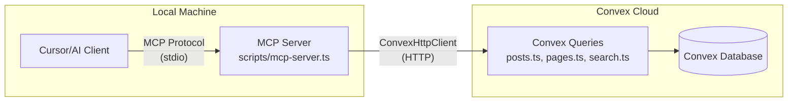

# MCP Server Implementation Plan

## Overview

Add MCP (Model Context Protocol) server capability to enable AI tools like Cursor to access blog content. The server runs locally, connects to Convex via HTTP client, and exposes read-only tools for accessing posts, pages, homepage data, and search functionality.

## Architecture



## Implementation Steps

### 1. Add MCP SDK Dependency

**File:** `package.json`

- Add `@modelcontextprotocol/sdk` to dependencies
- Version: Use latest stable version (check npm registry)
- Add `mcp` script: `"mcp": "tsx scripts/mcp-server.ts"`

### 2. Create MCP Server Script

**New File:** `scripts/mcp-server.ts`

**Key Components:**

- Import MCP SDK: `@modelcontextprotocol/sdk`
- Use `ConvexHttpClient` pattern from `sync-posts.ts`
- Load environment: Read `VITE_CONVEX_URL` from `.env.local` (development) or `.env.production.local` (production)
- Implement stdio transport for MCP protocol
- Use `Server` class from MCP SDK
- Log to stderr (not stdout) to avoid corrupting JSON-RPC messages

**MCP Tools to Implement:**

1. **`list_posts`** - Get all published posts
   - Calls: `api.posts.getAllPosts`
   - Returns: Array of post metadata (no content)

2. **`get_post`** - Get single post by slug with full content
   - Args: `slug: string`
   - Calls: `api.posts.getPostBySlug`
   - Returns: Full post object with content

3. **`list_pages`** - Get all published pages
   - Calls: `api.pages.getAllPages`
   - Returns: Array of page metadata (no content)

4. **`get_page`** - Get single page by slug with full content
   - Args: `slug: string`
   - Calls: `api.pages.getPageBySlug`
   - Returns: Full page object with content

5. **`get_homepage`** - Get homepage structure and featured content
   - Calls: `api.posts.getFeaturedPosts`, `api.pages.getFeaturedPages`, `api.posts.getAllPosts` (limited)
   - Returns: Combined homepage data structure

6. **`search_content`** - Full text search across posts and pages
   - Args: `query: string`
   - Calls: `api.search.search`
   - Returns: Search results with snippets

7. **`export_all`** - Batch export all posts and pages with full content
   - Calls: Multiple queries to get all content
   - Returns: Complete content export

**Error Handling:**

- Validate Convex URL is set
- Handle Convex query errors gracefully
- Return user-friendly error messages
- Never expose internal errors to MCP clients

**Security:**

- Read-only access (no mutations)
- Uses existing public Convex queries
- No authentication needed (public content)
- Each user runs their own server locally

### 3. Create Blog Post with Usage Instructions

**New File:** `content/blog/how-to-use-mcp-server.md`

**Content Sections:**

- What is MCP and why use it
- Prerequisites (Node.js, Convex deployment)
- Installation steps
- Starting the MCP server
- Cursor configuration example
- Available tools reference
- Troubleshooting common issues
- Security considerations

**Frontmatter:**

```yaml
title: "How to Use the MCP Server"
description: "Guide to setting up and using the Model Context Protocol server with Cursor and other AI tools"
date: "2025-12-28"
slug: "how-to-use-mcp-server"
published: true
tags: ["mcp", "cursor", "ai", "tutorial"]
```

### 4. Update Documentation Files

**File:** `content/pages/docs.md`

Add new section "MCP Server" after "API Endpoints" section:

- Overview of MCP server capability
- Quick start: installation and running
- Available tools list with descriptions
- Cursor configuration example
- Link to detailed blog post

**File:** `content/blog/setup-guide.md`

Add subsection under "Next Steps" or create new section:

- Brief mention of MCP server capability
- Link to detailed guide
- Quick setup command reference

**File:** `src/config/siteConfig.ts`

Add optional MCP configuration (if needed for future features):

- Consider adding `mcpServer` config object for future extensibility
- For now, keep it simple - server reads from environment variables

### 5. Update Reference Files

**File:** `files.md`

Add entry under "Scripts (`scripts/`)" section:

```markdown
| `mcp-server.ts` | MCP server for AI tool integration (Cursor, etc.). Exposes read-only tools for accessing blog posts, pages, and search. Uses ConvexHttpClient to connect to Convex deployment. |
```

**File:** `changelog.md`

Add entry at top:

```markdown
## [Unreleased]

### Added

- MCP (Model Context Protocol) server for AI tool integration
- Read-only access to blog posts, pages, homepage, and search
- Local server connects to Convex via HTTP client
- Exposes 7 tools: list_posts, get_post, list_pages, get_page, get_homepage, search_content, export_all
- Cursor configuration support
- Blog post: "How to Use the MCP Server"
```

**File:** `content/pages/changelog-page.md`

Add same entry at top (before v1.38.0)

### 6. Update README.md

**File:** `README.md`

Add section "MCP Server" after "Fork Configuration" or in appropriate location:

- Brief description
- Quick start command
- Link to detailed documentation
- Note about read-only access

## Technical Details

### Environment Variables

The MCP server reads `VITE_CONVEX_URL` from:

- `.env.local` (development)
- `.env.production.local` (production)

Users can specify via environment variable or config file.

### MCP Server Pattern

Follow the TypeScript MCP server pattern from official docs:

- Use `Server` class from `@modelcontextprotocol/sdk`
- Implement stdio transport
- Define tools with proper schemas
- Handle errors gracefully
- Log to stderr only

### Convex Query Usage

All tools use existing public queries:

- `api.posts.getAllPosts`
- `api.posts.getPostBySlug`
- `api.posts.getFeaturedPosts`
- `api.pages.getAllPages`
- `api.pages.getPageBySlug`
- `api.pages.getFeaturedPages`
- `api.search.search`

No new Convex functions needed - leverages existing API.

## Security Considerations

1. **Read-only access**: Only queries, no mutations exposed
2. **Public content only**: Uses same queries as public website
3. **Local execution**: Server runs on user's machine
4. **No authentication**: Blog content is public by design
5. **Error handling**: Never expose internal errors or stack traces

## Testing Checklist

- [ ] MCP server starts without errors
- [ ] All 7 tools respond correctly
- [ ] Convex connection works (dev and prod)
- [ ] Error handling works for missing Convex URL
- [ ] Error handling works for invalid queries
- [ ] Cursor can connect and use tools
- [ ] Documentation is clear and complete
- [ ] Blog post provides step-by-step instructions

## Files to Create

1. `scripts/mcp-server.ts` - Main MCP server implementation
2. `content/blog/how-to-use-mcp-server.md` - Usage guide blog post

## Files to Update

1. `package.json` - Add dependency and script
2. `content/pages/docs.md` - Add MCP Server section
3. `content/blog/setup-guide.md` - Add MCP mention
4. `src/config/siteConfig.ts` - Optional future config (minimal changes)
5. `files.md` - Add script description
6. `changelog.md` - Add feature entry
7. `content/pages/changelog-page.md` - Add feature entry
8. `README.md` - Add MCP Server section

## Dependencies

- `@modelcontextprotocol/sdk` - MCP SDK for TypeScript
- Existing: `convex`, `dotenv`, `tsx` (already in package.json)

## Notes

- No newsletter or email features exposed (as requested)
- Server is read-only for security
- Uses existing Convex queries (no backend changes needed)
- Follows same pattern as `sync-posts.ts` for Convex connection
- Compatible with Cursor and other MCP clients
