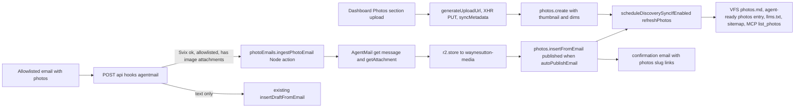

# Photos gallery: /photos with R2, email door, and agent surfaces

Reference look: [photos.ana.sh/grid](https://photos.ana.sh/grid). We keep square grid tiles, a right rail with TAGS and photo count, a view toggle (grid default, full frame), and drop the cameras group. Everything uses existing theme tokens (`--bg-*`, `--text-*`, `--border-color`, `--accent`, `--font-family`) and existing chip/modal/overlay classes so it matches the four themes.

Decisions already made with you: emailed photos from allowlisted senders auto publish; each photo gets `/photos/<slug>`.

## Data model

New table `photos` in [convex/schema.ts](convex/schema.ts) (dashboard and email door are the only writers; not stored in `mediaAssets` so the Media Library cannot orphan a photo):

```ts
photos: defineTable({
  slug: v.string(), // /photos/<slug>, unique
  title: v.optional(v.string()),
  description: v.optional(v.string()),
  tags: v.array(v.string()), // lowercased, deduped
  provider: v.union(v.literal("r2"), v.literal("convex")),
  key: v.string(), // R2 key or storage id
  url: v.string(), // permanent URL (permanentR2Url or storage URL)
  thumbnailKey: v.optional(v.string()),
  thumbnailUrl: v.optional(v.string()),
  width: v.optional(v.number()),
  height: v.optional(v.number()),
  size: v.number(),
  contentType: v.string(),
  published: v.boolean(),
  capturedAt: v.optional(v.number()), // manual date; sort key falls back to createdAt
  source: v.union(v.literal("dashboard"), v.literal("email")),
  sourceMessageId: v.optional(v.string()), // AgentMail idempotency
  createdAt: v.number(),
  updatedAt: v.number(),
})
  .index("by_slug", ["slug"])
  .index("by_published", ["published"])
  .index("by_sourcemessageid", ["sourceMessageId"]);
```

Small `photoSettings` singleton row (`key: "email"`, `autoPublishEmail: boolean`, default true) so the email auto publish has a kill switch in the dashboard without redeploying.

## Backend

- **[convex/lib/photosDirectory.ts](convex/lib/photosDirectory.ts)** (pure, browser safe, mirrors `lib/skillsDirectory.ts`): `PhotoDoc` type, `sortPhotos` (capturedAt ?? createdAt desc), `collectTagCounts`, `normalizeTags`, `parseTagLine` (for email body `tags: a, b`), `slugFromTitleOrFilename`, `buildPhotosMarkdown` (H1, count, tag list, one H3 per photo with title, description, tags, page URL, image URL, date). Used by the page's "Copy as markdown", VFS, and agent-ready so all three match.
- **[convex/lib/r2Client.ts](convex/lib/r2Client.ts)**: move `const r2 = new R2(components.r2)` and `permanentR2Url` here; [convex/r2.ts](convex/r2.ts) re-exports. Needed so the `"use node"` email action can call `r2.store` without importing a file that registers queries.
- **[convex/photos.ts](convex/photos.ts)** (pattern of [convex/skills.ts](convex/skills.ts), `requireDashboardAdmin`, `clearFields`, `scheduleDiscoverySyncIfEnabled({ refreshPhotos: true })`):
  - public: `listPublished` (by_published, `.take(600)`, sorted), `getBySlug`, `getMarkdown`
  - admin: `listAll`, `create` (called after client upload with key/url/thumb/dims), `update`, `remove` (deletes object via `deleteR2Object` or `ctx.storage.delete`, plus thumbnail), `setPublishedMany`, `getEmailSettings` / `setEmailAutoPublish`
  - internal: `insertFromEmail` (idempotent on `sourceMessageId`, honors `autoPublishEmail`), `listPublishedInternal`
- **[convex/photoEmails.ts](convex/photoEmails.ts)** (`"use node"`, mirrors [convex/draftEmails.ts](convex/draftEmails.ts)): `ingestPhotoEmail` internalAction: fetch message via `AgentMailClient.inboxes.messages.get`, keep attachments where `!inline` and `contentType` starts with `image/` (drops Gmail signature logos), download each with `inboxes.messages.getAttachment(inbox, message, attachmentId)` (verified in installed `agentmail@0.1.15`), cap 10 photos and 10 MB each, `r2.store(ctx, bytes, { type })` (fallback `ctx.storage.store`), then `insertFromEmail` per attachment. Title = subject (or filename), description = cleaned body minus the `tags:` line, tags from that line. Sends a short confirmation reply listing `/photos/<slug>` links (same AgentMail send pattern as `sendDraftPreview`).
- **[convex/http.ts](convex/http.ts)** AgentMail webhook (~1054 to 1232): after allowlist and before the draft path, if `message.attachments` has a non inline image, or the body is empty (photo only emails have no text), schedule `internal.photoEmails.ingestPhotoEmail`. The action falls back to the existing `insertDraftFromEmail` when it finds no image attachments, so the hydrate path keeps working. Also update [convex/draftEmails.ts](convex/draftEmails.ts) `ingestAgentMailMessage` to route the same way.
- **Agent surfaces**
  - [convex/virtualFs.ts](convex/virtualFs.ts): `/photos.md` in tree, `readFileHelper` alias, `## Photos` in `/index.md`.
  - [convex/agentReady/autoSync.ts](convex/agentReady/autoSync.ts): `refreshPhotos` flag, `reconcilePhotos` (path `/photos`, section `Photos`), called from `syncDiscovery` and [convex/agentReady/content.ts](convex/agentReady/content.ts) `regenerateAll`.
  - [convex/mcp.ts](convex/mcp.ts): `list_photos` tool (title, description, tags, url, imageUrl, capturedAt) on the public `mcp` limit.
  - [convex/http.ts](convex/http.ts) sitemap: add `/photos` and `/photos/<slug>` when `photosPage` is enabled and photos exist.
  - [convex/stats.ts](convex/stats.ts) `getPageType`/`buildPageStats` and [src/hooks/usePageTracking.ts](src/hooks/usePageTracking.ts): `photos` page type for `/photos` and `/photos/*`.



## Frontend: public page

- **[src/config/siteConfig.ts](src/config/siteConfig.ts)** `PhotosPageConfig`: `enabled` (default false), `showInNav`, `title: "Photos"`, `description?`, `order: 5`, `viewMode: "grid" | "full"` (default grid), `showViewToggle`, `showTagFilter`, `slideshowIntervalMs: 5000`.
- **[src/App.tsx](src/App.tsx)**: `/photos` and `/photos/:slug` routes gated by `siteConfig.photosPage?.enabled`, both render `Photos`. **[src/components/Layout.tsx](src/components/Layout.tsx)**: nav item when `enabled && showInNav` (MobileMenu inherits), add `/photos` to the wide content paths.
- **[src/pages/Photos.tsx](src/pages/Photos.tsx)** (classes `photos-page`, `photos-header`, `photos-view-toggle`, `photos-grid`, `photo-tile`, `photos-full`, `photos-rail`, `photos-tag-chip`):
  - header: view toggle (grid / full frame icons, localStorage `photos-view-mode`), Present button (`.slide-present-btn` style), Copy as markdown (Skills pattern), `document.title`.
  - grid: square tiles (`aspect-ratio: 1`, `object-fit: cover`, `loading="lazy"`, `thumbnailUrl ?? url`), 5 columns desktop, 3 at 768px, 2 at 480px, 8px gap; hover fades slightly like `.project-card`.
  - full frame: single column, natural aspect via stored width/height (no layout shift), title, description, tags under each image.
  - rail (desktop right, horizontal chip row on mobile): uppercase TAGS label, tag chips with counts using `.post-tag` pill tokens, active state via `--accent`; `N PHOTOS` count. Filter lives in `?tag=` so it is shareable and agent readable.
  - empty state text when no published photos.
- **[src/components/PhotoLightbox.tsx](src/components/PhotoLightbox.tsx)**: one overlay component with `mode: "lightbox" | "present"`, built on the `.image-lightbox-*` tokens and the `SlidePresentation` keyboard pattern (ArrowLeft/Right, Home/End, Escape, click thirds, touch swipe, body scroll lock, portal). Lightbox shows prev/next arrow buttons, `3 / 55` counter, caption (title, description, clickable tag chips), close, and preloads neighbors. Present mode hides caption chrome, autoplays at `slideshowIntervalMs` with a `.slide-progress` style bar, Space pauses, arrows override, Escape exits. Opening a photo pushes `/photos/<slug>` (respecting the active tag filter); closing navigates back to `/photos`; a direct visit to `/photos/<slug>` opens the lightbox on that photo and sets title/meta from it.
- **[src/utils/webmcp/catalog.ts](src/utils/webmcp/catalog.ts)** + **[src/hooks/useWebMcp.ts](src/hooks/useWebMcp.ts)**: page tools `list_photos` (tag filter) and `open_photo` (slug). Add `photos` to `docsTopics` so the catalog test still passes.
- CSS in [src/styles/global.css](src/styles/global.css) next to the projects/skills blocks; dashboard CSS in [src/styles/dashboard.css](src/styles/dashboard.css).

## Frontend: dashboard

- **[src/components/dashboard/PhotosSection.tsx](src/components/dashboard/PhotosSection.tsx)** (ProjectsSection structure): multi file drop zone (R2 `generateUploadUrl` → `uploadFileWithProgress` PUT → `syncMetadata` → `getPermanentUrl` → `photos.create`; falls back to Convex storage when provider is not r2), per file progress, then an editable list: thumbnail, title, description, tags (chips with suggestions from existing tags), capturedAt, published toggle; filters All / Unpublished / From email; bulk publish and delete with the `dashboard-modal dashboard-modal-delete` confirm; an "Email inbox" card with the auto publish toggle and the inbox address; hint when `photosPage.enabled` is false; a "Generate missing thumbnails" button for emailed photos.
- **[src/utils/photoThumbnail.ts](src/utils/photoThumbnail.ts)**: `createImageBitmap(file, { imageOrientation: "from-image" })` → canvas → WebP at 800px long edge (~60 to 120 KB) uploaded as `<key>-thumb.webp`; also returns natural width/height. Keeps a 55 photo grid at a few MB instead of 200 MB of phone originals. Emailed photos get their thumbnail from the backfill button (browser canvas, R2 CORS already allows GET).
- **[src/pages/Dashboard.tsx](src/pages/Dashboard.tsx)**: `"photos"` section id, nav item (Content group, `Images` icon), heading, render, ConfigSection state + generated `photosPage` code + config card `data-config-card="photos-page"`.
- [src/components/dashboard/configGroups.ts](src/components/dashboard/configGroups.ts) card, [src/utils/dashboardSearch.ts](src/utils/dashboardSearch.ts) `feature-photos` (also index the words "gallery", "lightbox", "slideshow", "email photos" so search lands on the section).

## Dashboard docs (Docs section)

In [src/components/dashboard/docsTopics.ts](src/components/dashboard/docsTopics.ts), following the `skills` topic shape (lines 1088 to 1123):

- **Overview table** (line 31 area): add a `Photos | Upload, tag, and publish photos for the /photos gallery. Email inbox.` row.
- **Site Config tabs table** (line 988): rename the group row to `Blog, projects, skills, and photos` and list `Photos Page`.
- **Search hints** (line 1034): add "photos", "gallery", "lightbox", "slideshow".
- **New topic `id: "photos"`, title `Photo gallery`** with these sections:
  - `## Photo gallery`: what `/photos` is, off by default until **Photos Page** is enabled in Site Config, show in nav separate, `/photos/<slug>` deep links.
  - `### Upload from the dashboard`: drop or pick many files, 10 MB per image, png/jpg/gif/webp, HEIC not supported (export as JPEG), progress per file, browser makes an 800px WebP thumbnail and records width/height, upload lands unpublished until you publish.
  - `### One photo`: field table: title (optional, tile caption in lightbox), description (optional), tags (lowercase chips, drive the rail filter and `?tag=`), date (manual, controls order), published, slug (auto from title or filename, editable).
  - `### Tags and views`: grid is default, full frame toggle, tag rail on desktop and chip row on mobile, filter is in the URL so you can share a tag.
  - `### Lightbox and presentation`: click a tile, arrows or keyboard (Left, Right, Home, End, Escape), swipe on touch, Present button autoplays at the configured interval, Space pauses, `P` key.
  - `### Email photos in`: send from an allowlisted address to the AgentMail inbox, attach images, subject becomes the title, body becomes the description, a `tags: canmore, nature` line sets tags, inline images and signatures are ignored, up to 10 photos per email, published immediately when **Auto publish emailed photos** is on (default), otherwise they wait in the Unpublished filter, you get a reply with links, run **Generate missing thumbnails** for emailed photos.
  - `### Site Config`: Photos Page card fields: enable, show in nav, title, description, nav order, default view, show view toggle, show tag filter, slideshow interval.
  - `### Agents`: `cat /photos.md` on the VFS, `/photos` entry in `/llms.txt` and agent-ready, MCP `list_photos`, WebMCP `list_photos` and `open_photo`, publishing schedules a discovery refresh like a post, "Copy as markdown" on the public page uses the same builder (`convex/lib/photosDirectory.ts`).
  - `### Troubleshooting`: photo not showing (unpublished, route off, tag filter active), email ignored (sender not allowlisted, image was inline, HEIC), slow grid (run thumbnail backfill).
- Cross links: the Photos section header gets the same "Docs" link other sections use so the topic is one click away, and the Site Config Photos Page card help text points to the topic.
- The `catalog.test.tsx` docs assertion pattern (line 62) gets a matching `DOCS_TOPICS.some((t) => t.id === "photos")` check.

## Discovery, config, docs

- [scripts/sync-discovery-files.ts](scripts/sync-discovery-files.ts): query `api.photos.listPublished`, `# Photos` section in `public/llms.txt`, `/photos.md` in the VFS paths blurb.
- [agent-ready.config.json](agent-ready.config.json): Photos page entry (order 5), mention `photos.md` in the VFS endpoint and `agentInstructions`.
- Docs: `AGENTS.md` (`## Photos`, VFS paths, HTTP/MCP tables), `CLAUDE.md` key files, `content/pages/docs.md` VFS and MCP tables, `prds/setup-agent-blog.md` note on photo emails.
- Workflow files: `prds/photos-gallery.md` (this plan plus edge cases and verification), `TASK.md`, `changelog.md` (real dates from `git log`), `files.md`.

## Edge cases

- Slug collisions: append `-2`, `-3`. Filenames like `IMG_4021.HEIC`: HEIC is rejected client side with a clear message (browsers cannot decode it); email path skips non decodable types and says so in the reply.
- Inline images and non image attachments in emails are ignored; an email with zero usable images falls through to the draft path exactly as today.
- Duplicate webhook delivery: `by_sourcemessageid` plus attachment index makes ingest idempotent.
- Deleting a photo removes the original and thumbnail objects; failures to delete the object still remove the row (same as `deleteMediaAsset`).
- Tag filter with no matches shows the empty state, not a blank grid; `/photos/<slug>` for an unpublished or missing slug shows a not found message inside the page shell.
- Presentation mode respects `prefers-reduced-motion` (crossfade off).

## Verification

- `npx tsc --noEmit`, `npx tsc -p convex --noEmit`, `npx vitest run`, `npm run build`, `npx convex-doctor@latest` (stay 100 with 0 warnings; new public functions use indexes and `.take`).
- Dev: upload 3 photos with tags in the dashboard, confirm grid, full frame, tag filter, lightbox arrows and keys, present mode autoplay, `/photos/<slug>` direct load, Copy as markdown.
- Email: send a photo with subject and `tags: canmore, nature` from an allowlisted address to the dev inbox, confirm it publishes, appears in the grid, and the reply arrives.
- Agents: `curl -X POST .../vfs/exec -d '{"command":"cat /photos.md"}'`, MCP `list_photos`, `/llms.txt` after regenerate, sitemap contains `/photos`, stats shows `photos` page type.
- Tests: `convex/photos.test.ts` (markdown builder, tag parsing, sorting, slug collisions, admin gate), `convex/agentReadyAutoSync.test.ts` `/photos` entry, `src/utils/webmcp/catalog.test.tsx` still green.

## Out of scope (follow ups)

EXIF date extraction, server side thumbnails for the email path (browser backfill covers it), albums, homepage photo strip, OG image route for `/photos/<slug>` (crawlers get the SPA shell today, same as `/projects`), pagination beyond 600 photos.
