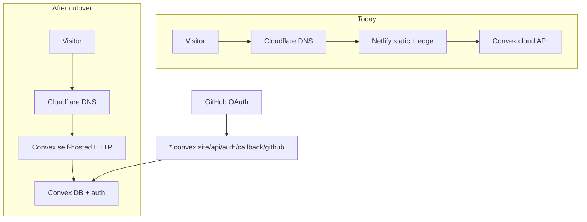

# waynesutton.ai production cutover guide

You run all commands. Nothing in this plan deploys for you.

**Target stack (already configured in code):**

- Auth: official Convex Auth via [`src/config/siteConfig.ts`](src/config/siteConfig.ts) (`auth.mode: "convex-auth"`)
- Dashboard sign-in: **GitHub OAuth only**
- Hosting: `@convex-dev/self-hosting` (`hosting.mode: "convex-self-hosted"`)
- Canonical site: `https://www.waynesutton.ai`

**Auth install reference (already wired in this repo; use for sanity checks):**

- Official setup guide: [Convex Auth](https://labs.convex.dev/auth)
- Local wiring: [`convex/auth.ts`](convex/auth.ts), [`convex/auth.config.ts`](convex/auth.config.ts), [`convex/http.ts`](convex/http.ts), [`convex/schema.ts`](convex/schema.ts), [`src/main.tsx`](src/main.tsx)

**Dashboard admins for waynesutton.ai:** exactly **three** GitHub primary emails you choose (not a `@convex.dev` domain wildcard). Store them only in Convex (env or `dashboardAdmins` table), never in git-tracked source. See [Email and secrets hygiene](#email-and-secrets-never-in-source-code) and [DASHBOARD_PRIMARY_ADMIN_EMAIL](#dashboard_primary_admin_email-when-to-use-and-how-to-set).

**Current live state (from prior checks):**

- `https://www.waynesutton.ai` still serves from **Netlify**
- A Convex self-hosted preview likely exists at something like `https://wandering-gecko-105.convex.site` (confirm your real prod deployment name in the Convex dashboard before you start)

---

## Architecture (what you are doing)



**Important:** GitHub OAuth **callback URL stays on** `https://<your-deployment>.convex.site/api/auth/callback/github` even after `www.waynesutton.ai` points at Convex. Do not point the callback at `www` unless Convex docs for your setup explicitly say to.

**Admin model:** [`convex/dashboardAuth.ts`](convex/dashboardAuth.ts) supports two modes:

1. **Strict single email** via `DASHBOARD_PRIMARY_ADMIN_EMAIL` (bypasses `dashboardAdmins` table). **Do not use** for waynesutton.ai; you need three admins.
2. **Allowlist table** via `dashboardAdmins` when `DASHBOARD_PRIMARY_ADMIN_EMAIL` is **unset**. Use this for your three admin emails.

---

## Email and secrets: never in source code

Admin emails, OAuth secrets, and bootstrap keys must **not** appear in files you commit.

### Where admin emails belong

| OK (runtime only) | Not OK (do not commit) |
|-------------------|-------------------------|
| Convex dashboard → Settings → Environment Variables | `convex/*.ts`, `src/*.ts`, `siteConfig.ts` |
| Convex dashboard → Data → `dashboardAdmins` | `package.json`, README, PRDs you push to GitHub |
| CLI: `npx convex env set ... --prod` | `.env.production.local` (gitignored; OK locally) |
| CLI: `npx convex run authAdmin:...` with email in terminal only | Changelog, blog posts, `public/` unless intentional contact |

### Pre-commit sanity check (optional)

Before `git commit`, confirm no personal admin emails leaked into tracked files:

```bash
git grep -i "wayne@" -- ':!*.plan.md' ':!.cursor/plans/*'
git grep -i "DASHBOARD_PRIMARY_ADMIN_EMAIL=" .
```

Expect **no matches** in `convex/`, `src/`, or config you plan to ship. [`convex/dashboardAuth.ts`](convex/dashboardAuth.ts) only reads `process.env.DASHBOARD_PRIMARY_ADMIN_EMAIL`; it never hardcodes an address.

### Private admin list (your machine only)

Keep your three allowlisted emails in a **local, gitignored** note (password manager, Notes app, or a file listed in `.gitignore`). Do not paste them into this plan if you copy the plan into the repo root.

Example local-only file (add to `.gitignore` if you create it):

```text
# admin-emails.local.txt (gitignored)
ADMIN_1=<admin-email-1>
ADMIN_2=<admin-email-2>
ADMIN_3=<admin-email-3>
```

Substitute `ADMIN_1`, `ADMIN_2`, `ADMIN_3` in the Phase 3 commands below when you run them.

### GitHub OAuth secrets

Same rule: `AUTH_GITHUB_ID` and `AUTH_GITHUB_SECRET` only via Convex env or dashboard, never in code.

---

## DASHBOARD_PRIMARY_ADMIN_EMAIL: when to use and how to set

This env var is read at **request time** in [`convex/dashboardAuth.ts`](convex/dashboardAuth.ts). When set, it is the **only** email that gets full dashboard admin. The `dashboardAdmins` table is **ignored**.

### When to use it

| Scenario | Use `DASHBOARD_PRIMARY_ADMIN_EMAIL`? |
|----------|--------------------------------------|
| Single human admin, simplest fork | **Yes** |
| waynesutton.ai with **three** admins | **No** (use `dashboardAdmins` instead) |
| Multiple admins | **No** (leave unset; use table + `grantDashboardAdmin`) |

### How to set it (single-admin forks or testing)

Production:

```bash
npx convex env set DASHBOARD_PRIMARY_ADMIN_EMAIL "<github-primary-email>" --prod
```

Development:

```bash
npx convex env set DASHBOARD_PRIMARY_ADMIN_EMAIL "<github-primary-email>"
```

Rules:

- Use the **exact** email GitHub shows on the account you sign in with (usually lowercase).
- Match is strict string equality after lowercasing; no `@convex.dev` wildcard.
- After setting, redeploy is **not** required; the next dashboard request picks up the new value.

### How to unset it (required for waynesutton.ai)

Three admins need the table allowlist. Remove strict mode on production:

```bash
npx convex env unset DASHBOARD_PRIMARY_ADMIN_EMAIL --prod
```

Confirm in [dashboard.convex.dev](https://dashboard.convex.dev) → Settings → Environment Variables → production: variable absent or empty.

### waynesutton.ai choice

| Setting | Value |
|---------|--------|
| `DASHBOARD_PRIMARY_ADMIN_EMAIL` | **Unset** on prod (and dev unless you are testing strict mode) |
| `dashboardAdmins` | Three rows, one per allowlisted GitHub primary email (Phase 3.2) |

If both are set by mistake, only `DASHBOARD_PRIMARY_ADMIN_EMAIL` wins and your other two admins will see the demo view.

---

## Phase 0: Pre-flight (15 min)

### 0.1 Confirm merge is clean

```bash
cd /Users/waynesutton/Documents/sites/waynesuttonai/waynesutton-ai
git status
```

- No `<<<<<<<` conflict markers in any file
- Resolved files are staged (or stage what you intend to commit)

### 0.2 Local sanity checks

```bash
npm install
npm run typecheck
npm run build
npx convex-doctor@latest
```

Expect convex-doctor **100/100**.

### 0.3 Find your production Convex deployment

Open [dashboard.convex.dev](https://dashboard.convex.dev) and note:

| What            | Where to find it                | Example                       |
| --------------- | ------------------------------- | ----------------------------- |
| Deployment name | Project → Production deployment | `wandering-gecko-105`         |
| Cloud URL       | Settings                        | `https://<name>.convex.cloud` |
| Site URL        | Settings / HTTP                 | `https://<name>.convex.site`  |

Write these down. You will use `<name>` everywhere below.

### 0.4 Create or verify `.env.production.local`

This file is gitignored. Create it at repo root if missing:

```bash
# .env.production.local (example — replace with YOUR values)
CONVEX_DEPLOYMENT=prod:<your-deployment-name>
VITE_CONVEX_URL=https://<your-deployment-name>.convex.cloud
VITE_CONVEX_SITE_URL=https://<your-deployment-name>.convex.site
VITE_SITE_URL=https://www.waynesutton.ai
```

Validate:

```bash
npm run validate:env:prod
```

### 0.5 GitHub OAuth app (create or update)

Go to [github.com/settings/developers](https://github.com/settings/developers) → your OAuth App (or create one).

| Field                      | Value                                                                 |
| -------------------------- | --------------------------------------------------------------------- |
| Homepage URL               | `https://www.waynesutton.ai`                                          |
| Authorization callback URL | `https://<your-deployment-name>.convex.site/api/auth/callback/github` |

Copy **Client ID** and **Client secret**. You will set them on Convex in Phase 3.

### 0.6 Confirm Convex Auth matches the official guide

Skim [Convex Auth](https://labs.convex.dev/auth) and confirm your repo already has these pieces:

| Step | File | Status in this repo |
|------|------|---------------------|
| Auth tables | `convex/schema.ts` | `...authTables` from `@convex-dev/auth/server` |
| Configure providers | `convex/auth.ts` | `providers: [GitHub]` |
| JWT trust | `convex/auth.config.ts` | `domain: process.env.CONVEX_SITE_URL` |
| HTTP routes | `convex/http.ts` | `auth.addHttpRoutes(http)` |
| React provider | `src/main.tsx` | `ConvexAuthProvider` wraps the app |

Dashboard sign-in uses **Sign in with GitHub** through `useAuthActions()`.

---

## Phase 1: Commit the merge

Only when Phase 0 passes.

```bash
git status
git diff --cached --stat
```

Commit with a message that matches your repo style, for example:

```bash
git commit -m "$(cat <<'EOF'
Merge upstream markdown-site refresh for waynesutton.ai.

Keep local content and branding; adopt Convex self-hosting and official Convex Auth defaults.
EOF
)"
```

Do **not** push unless you want the remote branch updated. Pushing is optional for deploy; deploy uses your local tree + Convex CLI.

---

## Phase 2: Deploy Convex backend (functions only)

This pushes `convex/` to **production** without uploading the Vite build yet.

```bash
npx convex deploy
```

When prompted, confirm **production** deployment (not dev).

**Check:** Convex dashboard → Functions → no deploy errors.

---

## Phase 3: Production Convex environment variables (GitHub auth + three admins)

Set auth and site metadata on **production** (use `--prod` on every `env set` / `unset`):

```bash
npx convex env set AUTH_GITHUB_ID "your-github-client-id" --prod
npx convex env set AUTH_GITHUB_SECRET "your-github-client-secret" --prod
npx convex env set JWT_PRIVATE_KEY "<generated-private-key>" --prod
npx convex env set JWKS "<generated-jwks>" --prod
npx convex env set SITE_URL "https://www.waynesutton.ai" --prod
```

`CONVEX_SITE_URL` is set automatically by Convex and is required for JWT trust. Do not confuse it with `SITE_URL` (your public marketing domain).

### 3.1 Unset single-email strict mode (required)

`DASHBOARD_PRIMARY_ADMIN_EMAIL` allows **only one** admin and ignores the `dashboardAdmins` table. For three admins, it must be **unset**:

```bash
npx convex env unset DASHBOARD_PRIMARY_ADMIN_EMAIL --prod
```

Do **not** add your email to any `.ts` file to achieve this; env only. See [DASHBOARD_PRIMARY_ADMIN_EMAIL](#dashboard_primary_admin_email-when-to-use-and-how-to-set).

### 3.2 Seed the three-admin allowlist (emails in Convex only)

After Phase 2 deploy, add **three** rows to `dashboardAdmins` using the GitHub **primary** emails from your private list (lowercase). Replace `YOUR_ADMIN_EMAIL_1` etc. in the terminal; do not commit those strings.

Pick **one** method.

**Method A: Bootstrap key (good for first-time prod)**

```bash
npx convex env set DASHBOARD_ADMIN_BOOTSTRAP_KEY "choose-a-long-random-secret" --prod

npx convex run authAdmin:bootstrapDashboardAdmin '{"bootstrapKey":"choose-a-long-random-secret","email":"YOUR_ADMIN_EMAIL_1"}' --prod
npx convex run authAdmin:bootstrapDashboardAdmin '{"bootstrapKey":"choose-a-long-random-secret","email":"YOUR_ADMIN_EMAIL_2"}' --prod
npx convex run authAdmin:bootstrapDashboardAdmin '{"bootstrapKey":"choose-a-long-random-secret","email":"YOUR_ADMIN_EMAIL_3"}' --prod
```

**Method B: First grant when table is empty (CLI, no bootstrap key)**

If `dashboardAdmins` has zero rows, [`grantDashboardAdmin`](convex/authAdmin.ts) does not require an existing admin:

```bash
npx convex run authAdmin:grantDashboardAdmin '{"email":"YOUR_ADMIN_EMAIL_1"}' --prod
npx convex run authAdmin:grantDashboardAdmin '{"email":"YOUR_ADMIN_EMAIL_2"}' --prod
npx convex run authAdmin:grantDashboardAdmin '{"email":"YOUR_ADMIN_EMAIL_3"}' --prod
```

**Method C: Convex dashboard UI**

Data → `dashboardAdmins` → insert three rows with `email` set to each allowlisted address (leave `subject` empty until first GitHub sign-in if you prefer). Typed in the dashboard only; nothing in git.

**Verify:** Data → `dashboardAdmins` shows **3 rows**, no extra rows. Emails are not in any committed source file.

### 3.3 Auth mode check

- Keep `auth.mode: "convex-auth"` in siteConfig (already set).
- Dashboard auth uses official Convex Auth with GitHub OAuth.

**Optional** feature keys (only if you use them): `OPENAI_API_KEY`, `AGENTMAIL_API_KEY`, `FIRECRAWL_API_KEY`, Bunny media vars. See [`prds/sync-deploy-commands.md`](prds/sync-deploy-commands.md).

**Verify in dashboard:** Settings → Environment Variables → production has `AUTH_GITHUB_*` and `SITE_URL`; **no** `DASHBOARD_PRIMARY_ADMIN_EMAIL`.

---

## Phase 4: Sync content to production DB

Content sync is separate from static deploy. This pushes `content/` → Convex tables.

```bash
npm run sync:all:prod
```

That runs, in order:

- `sync:prod` (posts + pages)
- `sync:wiki:prod`
- `sync:discovery:prod` (AGENTS.md, CLAUDE.md, llms.txt)

**Check:** Convex dashboard → Data → `posts`, `pages` have your Wayne Sutton content (not upstream `markdown.fast` placeholders).

---

## Phase 5: Deploy static app + functions (full production deploy)

```bash
npm run deploy
```

This runs `npx @convex-dev/self-hosting deploy`, which internally:

1. Builds Vite (`npm run build`)
2. Runs `npx convex deploy` again (safe if already done)
3. Uploads `dist/` to production Convex storage

**Do not** run `npm run build` yourself first.

If you **only** changed frontend files after Phase 2:

```bash
npm run deploy:static
```

---

## Phase 6: Verify on `.convex.site` (before DNS)

Test the Convex-hosted site **before** touching Cloudflare.

```bash
npm run verify:deploy:prod
```

Or pass the URL explicitly:

```bash
npm run verify:deploy:prod -- https://<your-deployment-name>.convex.site
```

[`scripts/verify-deploy.ts`](scripts/verify-deploy.ts) checks `/`, `/rss.xml`, `/sitemap.xml`, `/api/posts`, `/api/export`.

**Manual browser checks on** `https://<your-deployment-name>.convex.site`:

| Check                 | What to look for                                                            |
| --------------------- | --------------------------------------------------------------------------- |
| Homepage              | Posts load, Wayne Sutton branding                                           |
| `/blog`               | Your posts                                                                  |
| `/rss.xml`            | XML, correct titles                                                         |
| `/dashboard`          | Sign in with **GitHub**                                                     |
| Dashboard after login | Full admin only for the three allowlisted emails; others see demo + denied banner |
| `/stats`              | Loads if enabled in siteConfig                                              |

### 6.1 GitHub OAuth test (still on `.convex.site`)

1. Open `https://<deployment>.convex.site/dashboard`
2. Click sign in → **GitHub** (Convex Auth flow per [Convex Auth](https://labs.convex.dev/auth))
3. Sign in with an allowlisted GitHub account (email must match one of the three rows in `dashboardAdmins`)
4. If denied: run debug query after sign-in (Convex dashboard → Functions → run):
   - `authAdmin:getCurrentDashboardAuthDebug` → check `authUserEmail` vs `dashboardAdmins` rows
5. If another `@convex.dev` user signs in: they must **not** get admin unless that exact address is one of your three table rows
6. If 500 on callback: GitHub app callback must **exactly** match `https://<deployment>.convex.site/api/auth/callback/github`

See troubleshooting in [`prds/adding-robel-auth.md`](prds/adding-robel-auth.md) and [`.cursor/skills/robel-auth/SKILL.md`](.cursor/skills/robel-auth/SKILL.md).

---

## Phase 7: Add custom domain in Convex (before DNS cutover)

In [dashboard.convex.dev](https://dashboard.convex.dev) → your **production** deployment → **Settings** → **Custom Domains**:

1. Add `www.waynesutton.ai` (and optionally apex `waynesutton.ai` if you use it)
2. Copy the DNS records Convex shows (usually CNAME or A/AAAA targets)
3. Wait until Convex shows domain **verified** / certificate ready (can take minutes to an hour)

If Convex asks for env overrides (`CONVEX_CLOUD_URL`, `CONVEX_SITE_URL`), follow the dashboard copy-paste values, then redeploy:

```bash
npm run deploy
```

Canonical URL in app code and `SITE_URL` should remain `https://www.waynesutton.ai`.

---

## Phase 8: Cloudflare DNS cutover (you do this)

**Before changing records:** lower TTL on existing records to 300s (5 min) and wait one old TTL cycle if possible.

### 8.1 Document current Netlify records

In Cloudflare DNS for `waynesutton.ai`, note what points to Netlify today (often CNAME `www` → Netlify, apex ALIAS/ANAME or redirect).

### 8.2 Switch to Convex targets

Replace Netlify targets with the records from Convex custom domain setup. Typical pattern:

| Type       | Name  | Target                                                             |
| ---------- | ----- | ------------------------------------------------------------------ |
| CNAME      | `www` | Value Convex gives you                                             |
| (optional) | `@`   | Apex record Convex documents, or redirect `waynesutton.ai` → `www` |

**Proxy status:** Cloudflare orange-cloud (proxied) is usually fine; if SSL issues appear, try DNS-only (grey cloud) temporarily per Convex docs.

### 8.3 Do not delete Netlify yet

Keep the Netlify site live until Phase 9 passes. Rollback = revert Cloudflare records to Netlify.

### 8.4 Propagation checks

```bash
curl -sI https://www.waynesutton.ai | head -20
```

After cutover you want Convex/Cloudflare signatures (not `server: Netlify`).

```bash
npm run verify:deploy:prod -- https://www.waynesutton.ai
```

---

## Phase 9: Post-DNS verification (including auth after cutover)

| Step | Action                                                                                                                                              |
| ---- | --------------------------------------------------------------------------------------------------------------------------------------------------- |
| 9.1  | `npm run verify:deploy:prod -- https://www.waynesutton.ai`                                                                                          |
| 9.2  | Homepage, blog post, RSS, sitemap on custom domain                                                                                                  |
| 9.3  | `https://www.waynesutton.ai/dashboard` → **GitHub** sign-in                                                                                         |
| 9.4  | Confirm OAuth callback URL in GitHub app is still `https://<deployment>.convex.site/api/auth/callback/github` (unchanged after custom domain)       |
| 9.5  | Test admin access once per allowlisted GitHub account (primary email must match a `dashboardAdmins` row) |
| 9.6  | Negative test: sign in with a GitHub account that is **not** one of the three → demo view, no full dashboard |
| 9.7  | Negative test: another `@convex.dev` GitHub email that is **not** in your three rows → must **not** receive admin |
| 9.8  | Search (Cmd+K), Ask AI, stats heartbeat if you use them                                                                                             |

### 9.1 Auth checklist after cutover

- [ ] No admin emails committed in `convex/`, `src/`, or tracked config (see [Email and secrets hygiene](#email-and-secrets-never-in-source-code))
- [ ] `DASHBOARD_PRIMARY_ADMIN_EMAIL` is **unset** on production (three admins use table mode)
- [ ] `dashboardAdmins` table has exactly **3** email rows (set via dashboard or CLI only)
- [ ] `AUTH_GITHUB_ID` and `AUTH_GITHUB_SECRET` set on production
- [ ] Dashboard uses Convex Auth with GitHub OAuth
- [ ] Callback URL still on `*.convex.site` path above

---

## Phase 10: Decommission Netlify (later)

Only after 24–48 hours of stable traffic:

- Disable Netlify deploy hooks / stop auto builds
- Remove or archive Netlify site
- Remove old Netlify DNS records from Cloudflare if duplicated
- Update any external links that pointed at old Netlify deploy previews

Legacy scripts [`deploy:netlify`](package.json) remain for rollback reference; you do not need them with `hosting.mode: "convex-self-hosted"`.

---

## Command cheat sheet (your recommended order)

```bash
# 1 Commit (when ready)
git commit -m "Merge upstream; waynesutton.ai Convex self-hosting"

# 2 Backend
npx convex deploy

# 3 Env (production) + three admins
npx convex env set AUTH_GITHUB_ID "..." --prod
npx convex env set AUTH_GITHUB_SECRET "..." --prod
npx convex env set SITE_URL "https://www.waynesutton.ai" --prod
npx convex env unset DASHBOARD_PRIMARY_ADMIN_EMAIL --prod
# Bootstrap or grant the three emails (see Phase 3.2)

# 4 Content
npm run sync:all:prod

# 5 Static + backend bundle
npm run deploy

# 6 Test convex.site
npm run verify:deploy:prod -- https://<deployment>.convex.site

# 7 Convex dashboard: add custom domain www.waynesutton.ai

# 8 Cloudflare: point www (and apex) to Convex

# 9 Test custom domain
npm run verify:deploy:prod -- https://www.waynesutton.ai

# 10 Re-test /dashboard OAuth on www
```

---

## Rollback plan

| Problem                      | Rollback                                                                     |
| ---------------------------- | ---------------------------------------------------------------------------- |
| Site broken after DNS change | Revert Cloudflare DNS to Netlify records                                     |
| Auth broken                  | Verify GitHub callback on `.convex.site`; verify `AUTH_GITHUB_*`; confirm `DASHBOARD_PRIMARY_ADMIN_EMAIL` unset and three rows in `dashboardAdmins` |
| Wrong user gets admin        | Remove stray `dashboardAdmins` rows; never use domain wildcards; only exact emails |
| Wrong content                | Re-run `npm run sync:all:prod`                                               |
| Bad deploy                   | Redeploy previous git commit: checkout known-good commit, `npm run deploy`   |

---

## After you finish (docs housekeeping)

Per [workflow](.cursor/rules/workflow.mdc):

1. Move tasks to **Completed** in [`TASK.md`](TASK.md)
2. Add entry to [`changelog.md`](changelog.md) with today's date
3. Optionally save this guide as [`prds/waynesutton-ai-production-cutover.md`](prds/waynesutton-ai-production-cutover.md) for future you

---

## Reference files

- Convex Auth docs: [labs.convex.dev/auth](https://labs.convex.dev/auth)
- Migration PRD: [`prds/convex-auth-github-dashboard.md`](prds/convex-auth-github-dashboard.md)
- Dashboard admin logic: [`convex/dashboardAuth.ts`](convex/dashboardAuth.ts), [`convex/authAdmin.ts`](convex/authAdmin.ts)
- Sync vs deploy: [`prds/sync-deploy-commands.md`](prds/sync-deploy-commands.md)
- Env validator: [`scripts/validate-env.ts`](scripts/validate-env.ts)
- Deploy verifier: [`scripts/verify-deploy.ts`](scripts/verify-deploy.ts)
